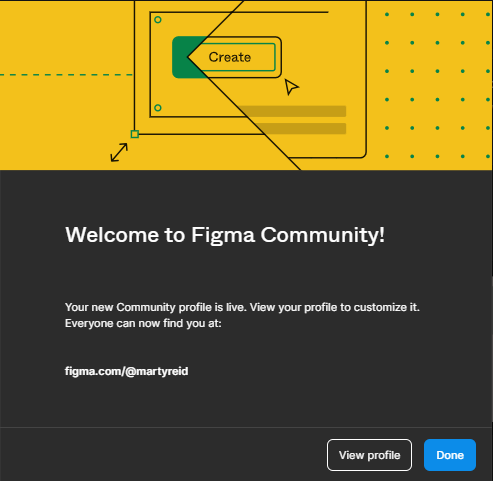

{: .no_toc }

# Figma Community Profile

In Figma click on you Profile avatar to left & select **Settings**

Then click on **Community** link on the top bar

Click **Claim Handle**

You need to select a username this must not have already been claimed

Once successfully selected click on **Create Profile**

Click on **View Profile**

You can now see your profile page

