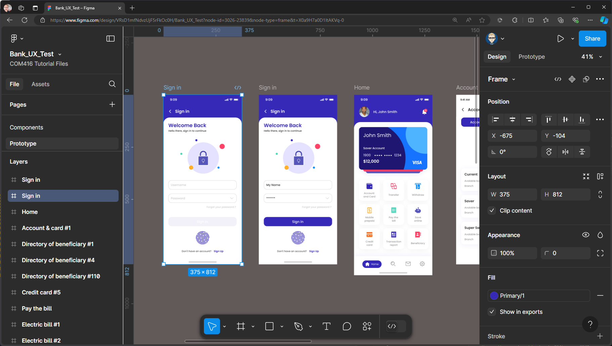
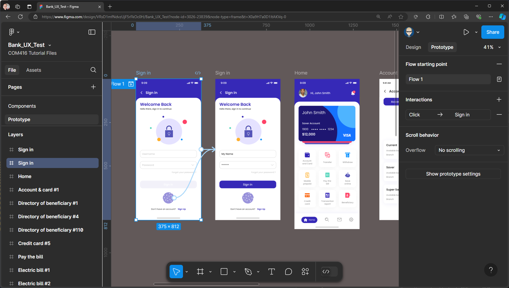
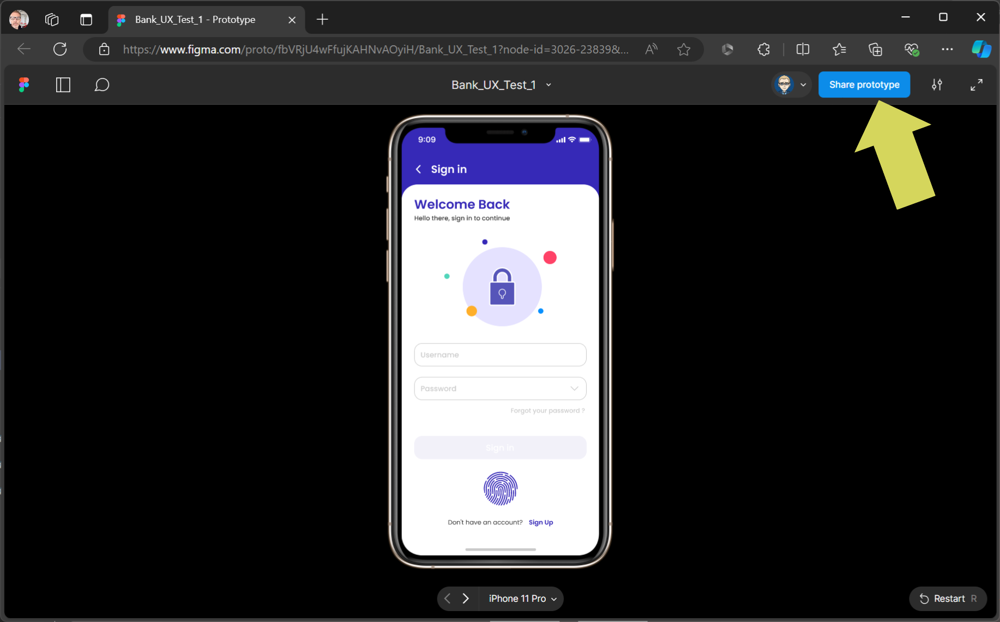
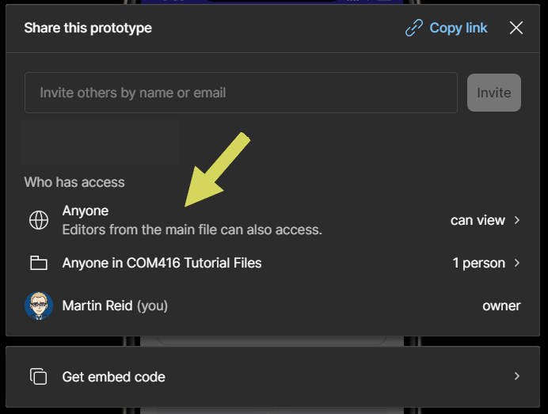
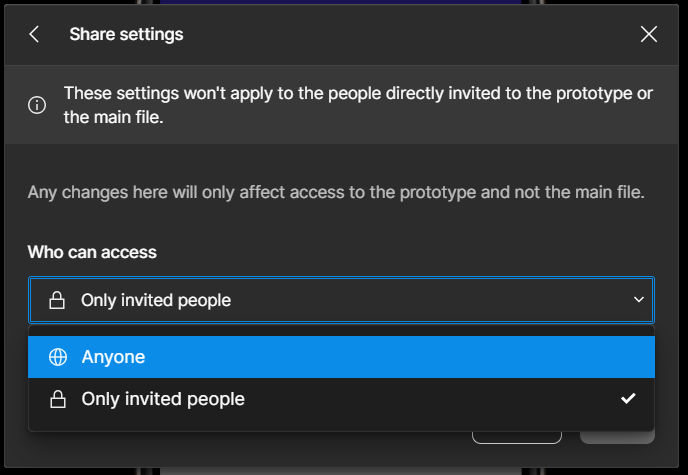
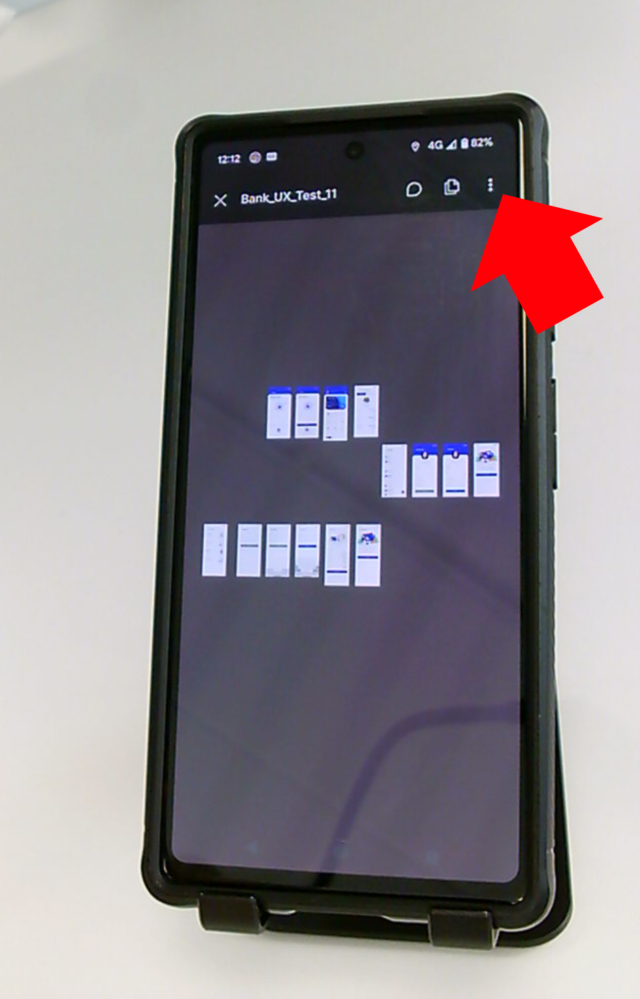
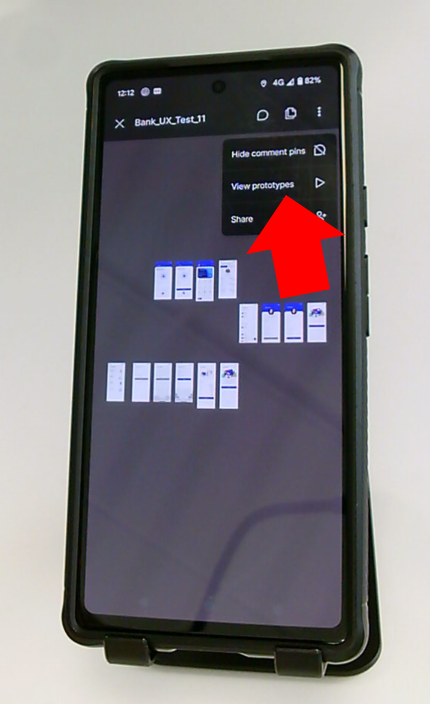
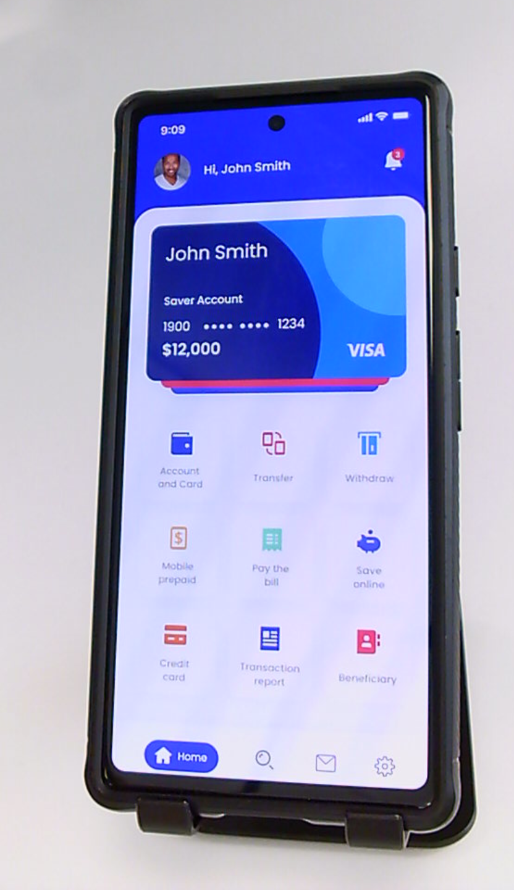
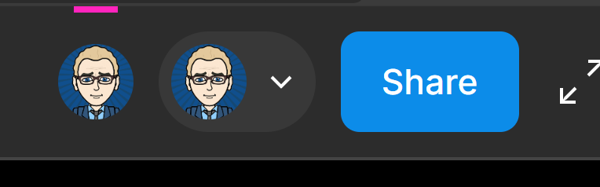
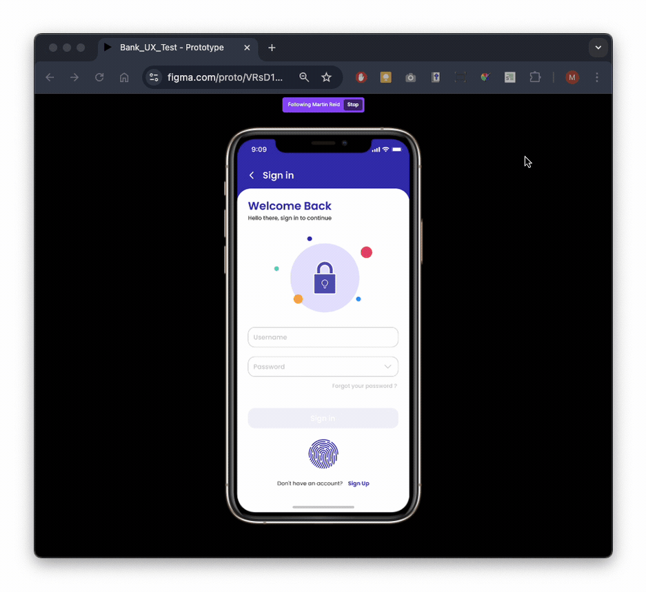

{: .no_toc }

# Testing on a device
You have made your Prototype and it time to share and use it in a UX testing session.

1. Select the first screen (Frame) of your Prototype

2. Change the Design view to Prototype

3. Click on Share Prototype button

4. You can email an invite to people or you can have it accessible to everyone - you can click to change

5. Invite Only or Anyone

6. On the test device click on 3 dots top right

Then click view prototype

There are issues with Figma wanting a person who has been sent a link, but does not have Figma account and Figma app opening the Prototype [more details here](https://forum.figma.com/t/sharing-a-prototype-without-having-user-required-to-sign-in-to-figma/40423)

or if they can open it without a Figma account and the Figma app it will not present full screen.

To get round this this they would have to sign up for a Free Figma account, then download the app to open the prototype link which might be a hassle to them or you could use a test who you know has a Figma account and app, **or if doing in-person testing you can use the app set up on your device, which might be the best solution**

**Note:** This only applies to tests on phones or tablets - if UX testing a website, this will not be an issues as it will work in the browser without a log in.

7. The prototype will now open up on the test device.

8. Check the prototype on your computer. You'll see two users displayed in the top bar. If the tester is logged in using your Figma app, there will be two instances of your avatar. Otherwise, you'll see either their Figma avatar or an anonymous user icon.

9. In any case you need to select the user logged in on the test device 

The computer login will show **Multi-Player Tools**, the test device will have **Click to Follow** Click to follow

10. Now when the tester interacts with the prototype on the test device their interactions will be reproduce in the Figma prototype on the computer., so the screen can be recorded for later analyst.

