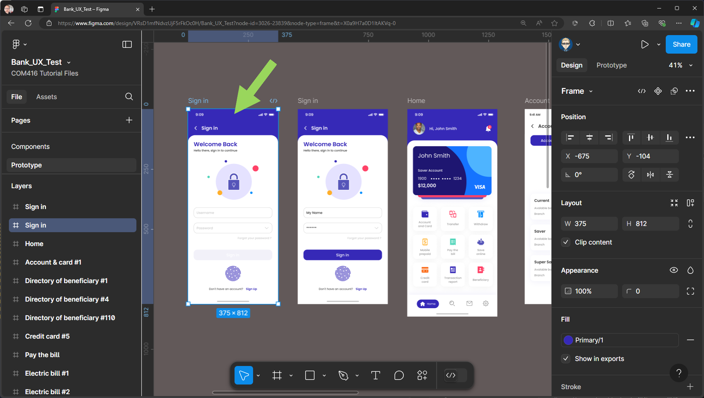
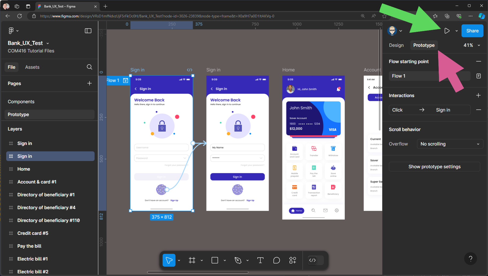
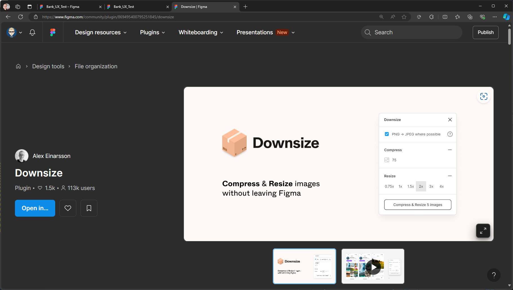
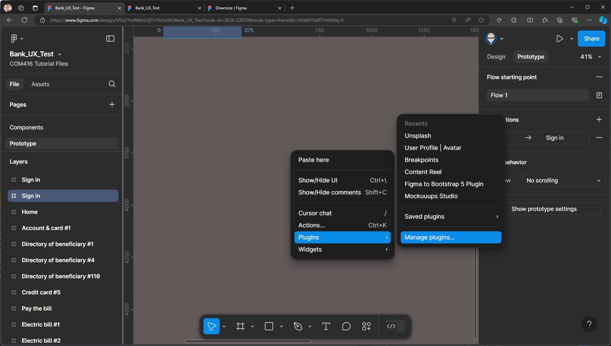

{: .no_toc }

# Share Your Prototype
You have made your Prototype and it time to share and use it in a UX testing session.

1. Select the first screen (Frame) of your Prototype

2. Change the Design view to Prototype

3. Click on Share Prototype button

4. You can email an invite to people or you can have it accessible to everyone - you can click to change

5. Invite Only or Anyone

6. You can share either as a Link (best option) or an embed code to put on a website

Code will look like this - **ONLY USE THIS OPTION IT YOU ARE ADDING TO A WEBSITE**

### Is your Prototype running slowly?

If your Prototype is running slowly this might be due to the image file size being too large, you can use the **Downsize Plugin** to reduce image size with Figma.

1. Go back to the Design view - right-mouse on the pasteboard **Plugins > Manage Plugins**

2. Search for **Downsize**

3. Click the **Save** button to install the Plugin

