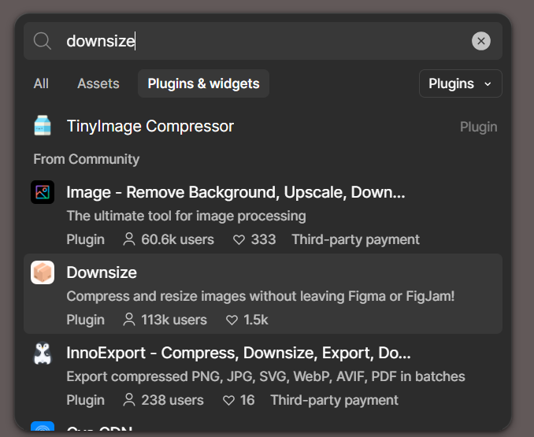

{: .no_toc }

### Is your Prototype running slowly?

If your Prototype is running slowly this might be due to the image file size being too large, you can use the **Downsize Plugin** to reduce image size with Figma.

1. Go back to the Design view - right-mouse on the pasteboard **Plugins > Manage Plugins**

2. Search for **Downsize**

3. Click the **Save** button to install the Plugin

