{: .no_toc }

# Prototyping - Text Fields

Creating a prototype in Figma that allows users to fill in text fields can be challenging. While there are solutions available through plugins and UI components in the Figma Community, these can be difficult to implement, especially for simpler projects. The most straightforward way to simulate a user adding text to a field is to mimic the experience.

	<iframe src="https://solent.cloud.panopto.eu/Panopto/Pages/Embed.aspx?id=b479f63d-53d9-4529-b62e-b225016483ce&autoplay=false&offerviewer=true&showtitle=true&showbrand=true&captions=true&interactivity=all" style="border: 1px solid #464646; position: absolute; top: 0; left: 0; width: 100%; height: 100%; box-sizing: border-box;" allowfullscreen allow="autoplay" aria-label="Panopto Embedded Video Player" title="Figma Prototyping - Text Fields"></iframe>

 

	<iframe src="https://solent.cloud.panopto.eu/Panopto/Pages/Embed.aspx?id=9526b42f-4402-4e28-85a5-b39301612981&autoplay=false&offerviewer=true&showtitle=true&showbrand=true&captions=true&interactivity=all" style="border: 1px solid #464646; position: absolute; top: 0; left: 0; width: 100%; height: 100%; box-sizing: border-box;" allowfullscreen allow="autoplay" aria-label="Panopto Embedded Video Player" title="Figma Text Prototype Text Input"></iframe>

 

  <iframe src="https://solent.cloud.panopto.eu/Panopto/Pages/Embed.aspx?id=2baee47b-01de-471f-9ddf-b22501802ea1&autoplay=false&offerviewer=true&showtitle=true&showbrand=true&captions=true&interactivity=all" style="border: 1px solid #464646; position: absolute; top: 0; left: 0; width: 100%; height: 100%; box-sizing: border-box;" allowfullscreen allow="autoplay" aria-label="Panopto Embedded Video Player" title="Prototype - Text Field Walk-through"></iframe>

### Plugin Resources

**Plugins for adding text into fields on Figma prototypes (Figma Community)**

1. **Interactive Text Input Fields (mobile & desktop)**  
	  
	[Open on Figma](https://www.figma.com/community/file/1327351869279090015/interactive-text-input-fields-for-keyboards-mobile-and-desktop)

2. **Text Inputs for Prototypes**  
	  
	[Open on Figma](https://www.figma.com/community/file/1253625006223812080)

3. **Google reCAPTCHA v2 (checkbox & invisible badge)**  
	  
	[Open on Figma](https://www.figma.com/community/file/882757166127187575)

4. **Interactive Text Fields – Typing with Keyboard**  
	  
	[Open on Figma](https://www.figma.com/community/file/1437033953557395543)

**Download:** [Text Input Figma Plugins PDF](../images/Plugins%20for%20adding%20text%202%20fields%20in%20Figma%20prototypes.pdf)

## Overview

We are going to create three screens that simulate typing an email address and password to log into an application. When it comes to user testing, it may not always be necessary to simulate something as basic as a login; however, this serves as an example of how you can simulate entering text into fields, which may not be possible in a Figma prototype.

### Set-up

In your Projects or Dashboard click **Create** and select **Design**

* Make sure you **name your design file.**
* Select **Assets** in the left panel
* Click on the **Library icon** to add Design System Libraries 

#### Add Libraries (Design Systems)

We will add two Design System Libraries which are availble through **Figma Comunity**

Search for **Material 3 Design Kit** & **Simple Design System** & click on **Add to file** and close **Manage Libraries** panel.

These libraries will appear and their components be available from the Assets panel

In the right panel change Assets **back** to **File**

### Adding Design System Kit to Components

We've already added our design kits to the Assets, so switch from File to Assets in the left panel.

If you have several Design System Kits in your Assets, you'll need to select the one you want to search.

**Adding Screen 1 Frame**

We now need to create our first screen. Either go to the tools at the bottom of the screen and select the Frame icon (the hash symbol), or press F on your keyboard. Then, in the properties panel on the right, choose Android Compact (412 × 917 pixels). Once the frame appears on your pasteboard, name it Screen

**Add the Status Bar Component**

Search for ``Building Blocks/status-bar`` in the Material design 3 library

Now drag out Status Bar onto the screen & postion it at the top

You will need to switch centre camera off as it might conflicted withe the on in the prototype preview

In the Properties panel on the right in the Status Bar section switch of Camera Cutout

**Add the App Bar Component**

Search for ``App bar`` in the Material design 3 library

Drag **App Bar** onto the screen

## Adding an Avatar 

Select the placeholder image inside the Avatar, selecting it in the Layers is the best approach

Now ``SHIFT + 2`` to zoom in on avatar image

Use either **Unsplash** or **User Profile/Avatar** plug-in - right mouse to open and select plug-ins

In this example we are on using Unsplash and we are searching for a face image

We will select square and free license

Choose an image

This will swop out the placeholder

``SHIFT + 1`` to zoom back out

**Add the Bottom App Bar Component**

Search for ``Bottom app bar`` in the Material design 3 library

Drag out the ``Bottom app bar`` to the bottom of your screen

**Re-order layers**

The order of your layers might not match the design hierarchy shown on your screen **to do this you need the swicth back to Files in the left panel**

If that's the case, you'll need to reorder the layers by dragging them into the correct order

**Add Log in Form Field**

Search for ``Form Log In`` in the **Simple Design** you will need to make sure you have switched to the Simple Design kit in the Assets

Then drag it onto the screen & prosition

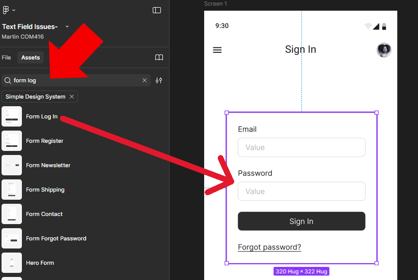

**Update Headline on Labal on Top App Bar**

We now need to change the generic label on the top app bar headline.

Click the top app bar to select it, either directly on the screen or from the layers outline.

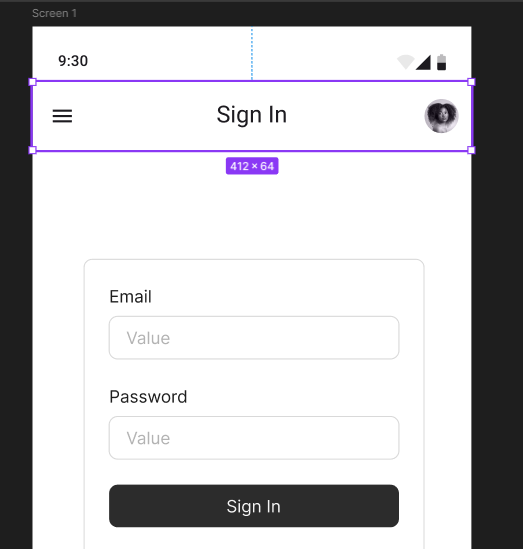

Press ``Shift + 2`` on your keyboard to zoom in on the component.

In the properties panel on the right, go down to the Headline field. Replace the word Label with Sign in, press Enter on your keyboard, and the headline title in the component will update.

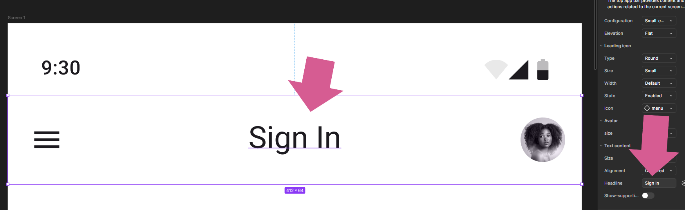

You can now press ``Shift + 1`` on your keyboard to zoom back out to full view.

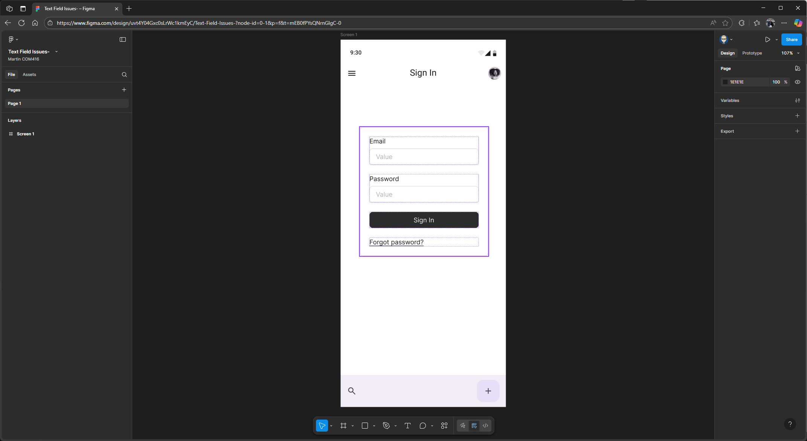

**Final Check**

In the left panel make sure you have **File** not **Assests**

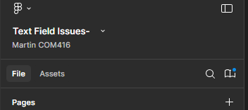

Make sure your layer outline matches the hierarchy shown on your screen. If it doesn’t, simply drag and drop the layers into the correct order.

It should look like this.

### Create Screen 2

Press ``Alt and Shift`` on your keyboard, hover over Screen 1, and drag to the right to create a copy. Figma usually works out the screen name for you, so you might not need to rename it – but if it doesn’t, you can do it manually rename new screen to Screen 2, either by updating the frame label or within the Layers panel

### Create Screen 3

Now, hover over Screen 2, then hold down the ``Alt and Shift`` keys on your keyboard and drag to the right to create a copy, this will become Screen 3, just like with the screen 2, Figma usually updates the label automatically. If it doesn’t, you’ll need to update it manually.

#### Adjust Screen Layers

In the Layers panel, make sure the frames for each screen are arranged in order: 1, 2and 3. If they’re not, drag them into the correct sequence. It’s a good idea to close each frame before you do this, to make organising them easier.

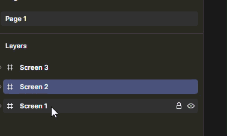

Select the **Log In** component on Screen 3 and delete it.

We’ll now update the headline title on the top app bar and change it to **Review**.

Click to select the component, then go to the properties panel on the right. Scroll down to the Headline field in the app bar component settings, type **Review** to replace the existing text, and press Enter to apply the change.

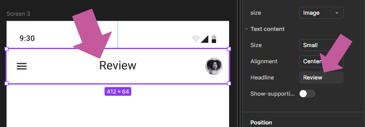

**Add the final component to Screen 3.** On the panel on the left, make sure you're in the **Assets** tab and using the **Simple Design Kit**. You might need to select this kit in the Assets panel before searching. 

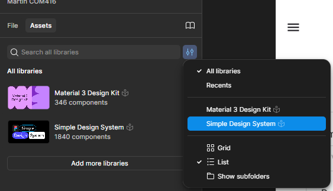

Once you're in the right kit, search for the ``Review Card`` component

Then drag and drop it onto Screen 3, positioning it in the centre if needed.

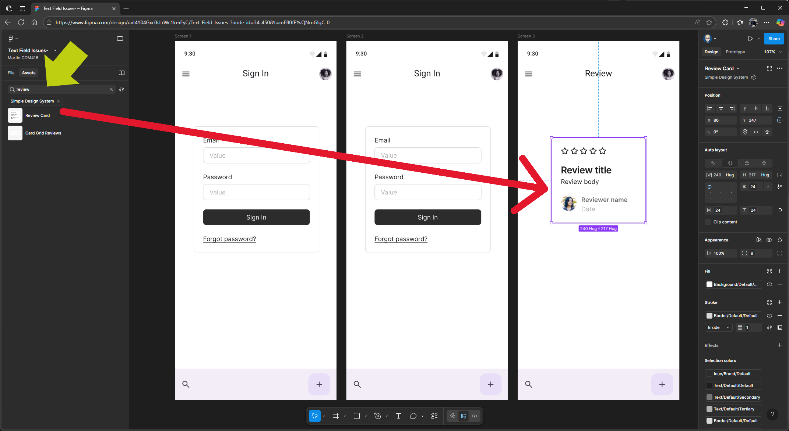

**Change the menu icon on the top app bar on Screen 3.**

On Screen 3, select the **hamburger icon** on the left side of the top app bar. Go to the Icon section in the left properties panel. From the dropdown where Menu is selected, search for Back, then click to select arrow back.

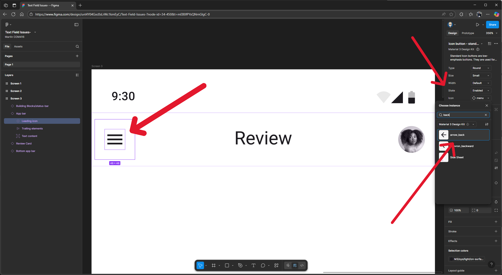

Back Arrow added

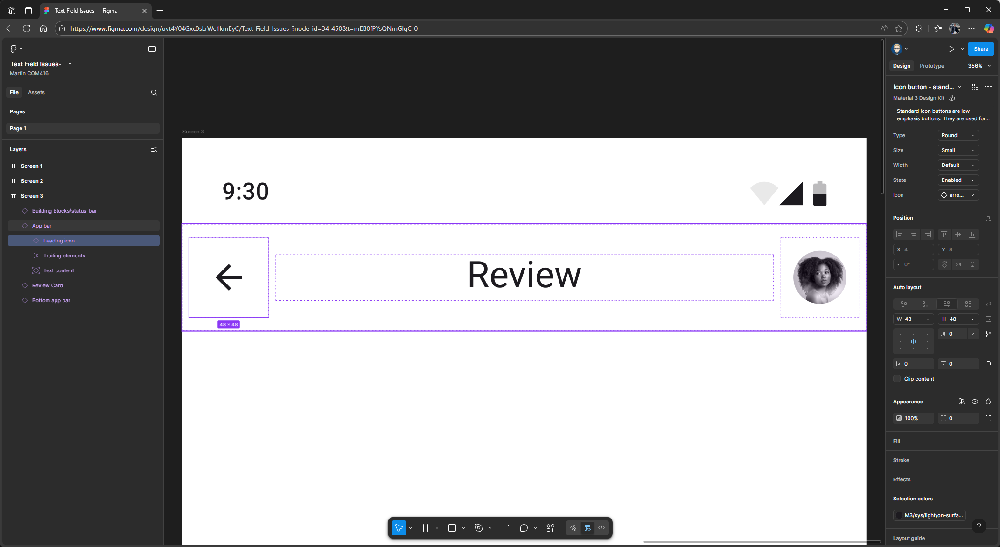

## Prototyping Setup

In the right **Properties** panel change Design to Prototype

On **Screen 2** Click on **Log In** to highlight this component

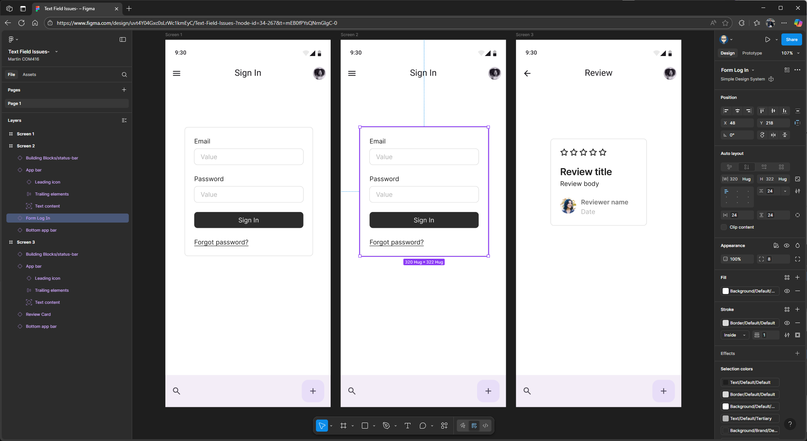

Press ``Shift 2`` on your keyboard to zoom in

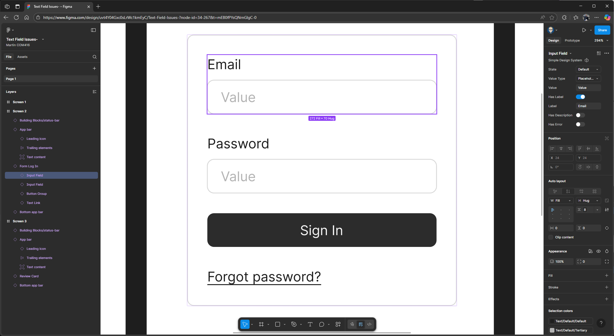

Highlight the email block and, in the properties panel on the right, make sure the value type is set to Placeholder. If it isn’t, change it using the dropdown. 
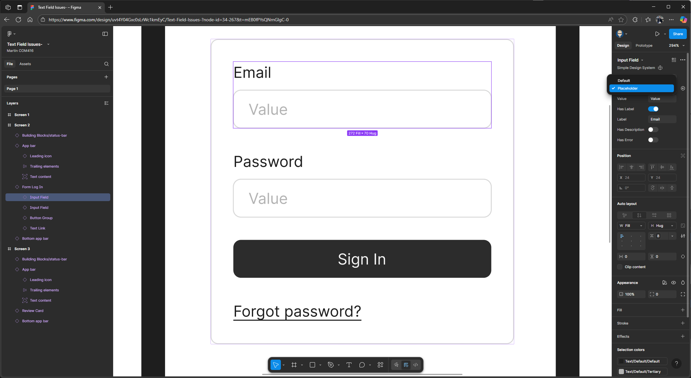

In the value field, type in a fake email address.

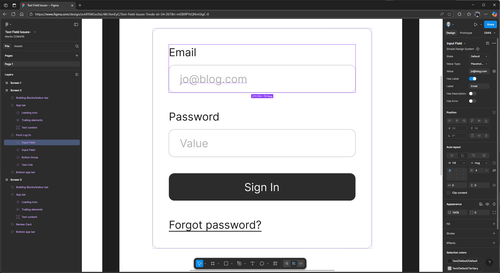

Next, select the password block. In the properties panel on the right, make sure the value type is also set to Placeholder. In the value field, type four asterisks (****) to represent a password, then press Enter on your keyboard.

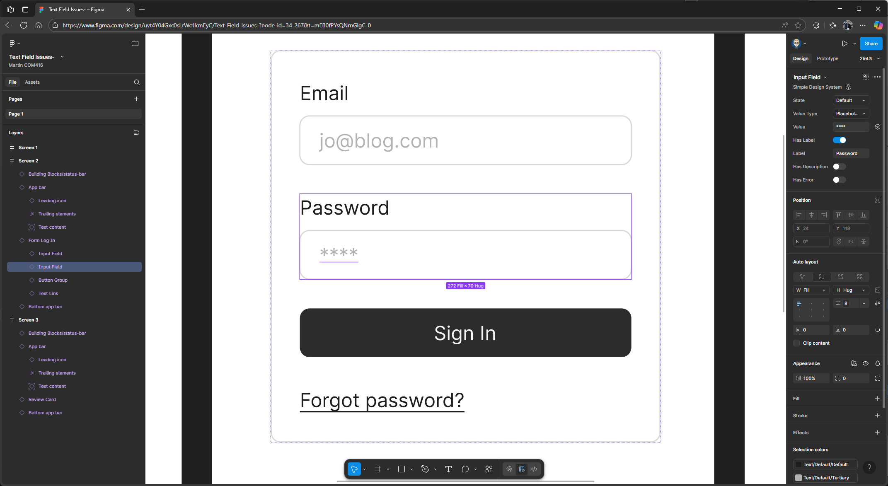

### Prototyping - Linking Screens together

In the properties panel, switch from Design to Prototype. In this example, we're targeting an Android Compact Bezel

Highlight the login component on Screen 1, then hover your mouse over the box and drag a flow connection to Screen 2. You can then close the interaction pop-up.

Click to highlight the Sign In button on Screen 2, then drag out a flow connection to Screen 3. You can then close the interaction pop-up.

Finally, we’ll use the back arrow on the top menu bar on Screen 3 to link back to Screen 1. Highlight the back icon, then drag out a flow connection to Screen 1. You can then close the interaction pop-up.

Now we can run and present our prototype. At the top of the properties panel, click the play button to launch it. If you click on the email field as if you’re typing your email and password, it will automatically take you to the next screen, where the email and password are pre-populated. Then, click the Sign In button to enter your application. This is how you can simulate adding text within a prototype.Text Field Issues-

<!--

If you have several Design System Kits in your Assets, you'll need to select the one you want to search.

-->