{: .no_toc }

# Prototyping - Text Fields

Creating a prototype in Figma that allows users to fill in text fields can be challenging. While there are solutions available through plugins and UI components in the Figma Community, these can be difficult to implement, especially for simpler projects. The most straightforward way to simulate a user adding text to a field is to mimic the experience.

	<iframe src="https://solent.cloud.panopto.eu/Panopto/Pages/Embed.aspx?id=b479f63d-53d9-4529-b62e-b225016483ce&autoplay=false&offerviewer=true&showtitle=true&showbrand=true&captions=true&interactivity=all" style="border: 1px solid #464646; position: absolute; top: 0; left: 0; width: 100%; height: 100%; box-sizing: border-box;" allowfullscreen allow="autoplay" aria-label="Panopto Embedded Video Player" title="Figma Prototyping - Text Fields"></iframe>

 

	

	<iframe src="https://solent.cloud.panopto.eu/Panopto/Pages/Embed.aspx?id=9526b42f-4402-4e28-85a5-b39301612981&autoplay=false&offerviewer=true&showtitle=true&showbrand=true&captions=true&interactivity=all" style="border: 1px solid #464646; position: absolute; top: 0; left: 0; width: 100%; height: 100%; box-sizing: border-box;" allowfullscreen allow="autoplay" aria-label="Panopto Embedded Video Player" title="Figma Text Prototype Text Input"></iframe>

 

  <iframe src="https://solent.cloud.panopto.eu/Panopto/Pages/Embed.aspx?id=2baee47b-01de-471f-9ddf-b22501802ea1&autoplay=false&offerviewer=true&showtitle=true&showbrand=true&captions=true&interactivity=all" style="border: 1px solid #464646; position: absolute; top: 0; left: 0; width: 100%; height: 100%; box-sizing: border-box;" allowfullscreen allow="autoplay" aria-label="Panopto Embedded Video Player" title="Prototype - Text Field Walk-through"></iframe>

**Plugins for adding Text into fields on Figma prototypes Available from Figma community**

**Interactive text input fields for keyboards (mobile and desktop)**

[interactive-text-input-fields-for-keyboards-mobile-and-desktop](https://www.figma.com/community/file/1327351869279090015/interactive-text-input-fields-for-keyboards-mobile-and-desktop)

**Text Inputs for Prototypes**

[https://www.figma.com/community/file/1253625006223812080 ](https://www.figma.com/community/file/1253625006223812080)

**Google reCAPTCHA v2 checkbox and invisible badge**

[https://www.figma.com/community/file/882757166127187575](https://www.figma.com/community/file/882757166127187575)

Interactive text fields: typing with keyboard

[https://www.figma.com/community/file/1437033953557395543](https://www.figma.com/community/file/1437033953557395543)

[Download Text Input Figma Plugins PDF](../images/Plugins%20for%20adding%20text%202%20fields%20in%20Figma%20prototypes.pdf)

## Setup

1.  Go to the COM416 Figma Team, select **All Projects**, then open the **Text Field Issues** project.

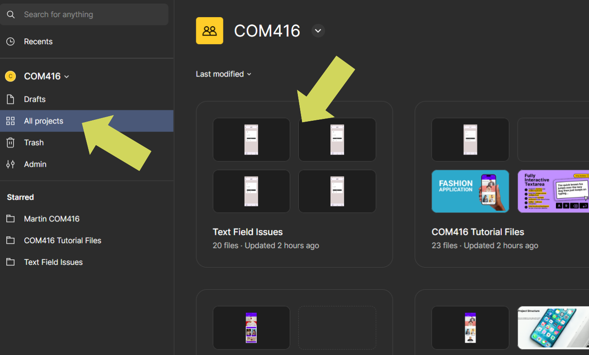

2.  You will be given a file number to go to, rename and use in this task.

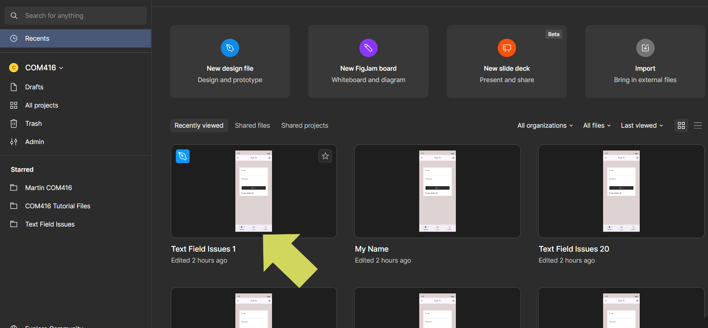

3.  Right-click the file and select **Rename**.

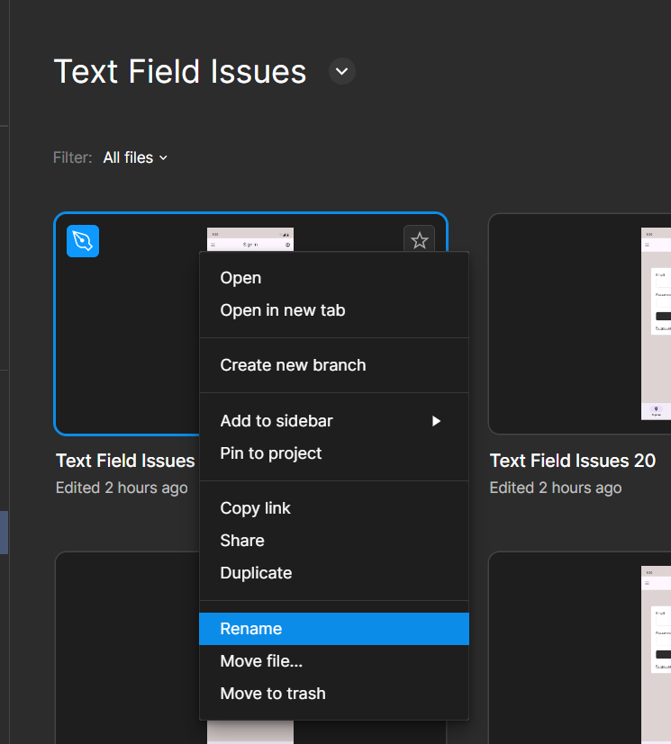

4.  Add your name.

5.  Bring in two Component Libraries - click the library icon in the left panel.

6.  Add **Material 3** & **Simple Design Systems/kits**, then close the panel.

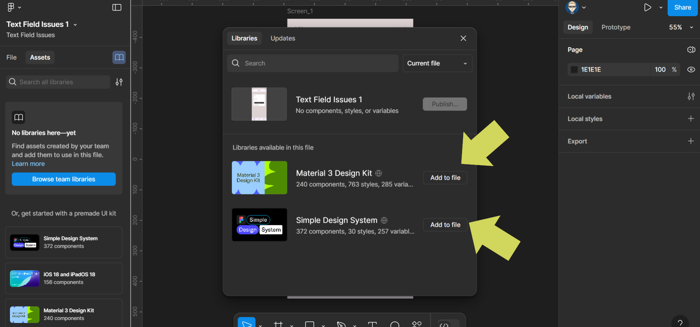

Or select from **UI Kits**:

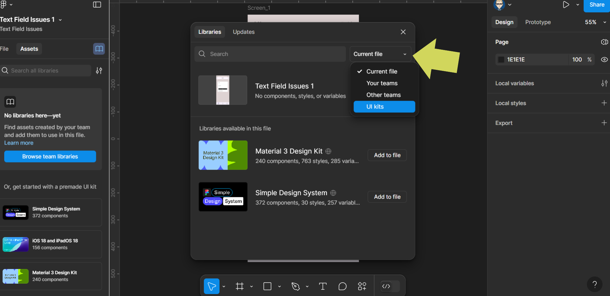

## Steps to Simulate Text Input

7.  Duplicate **Screen 1** - select the Frame.

8.  On PC: `CTRL + D` | On Mac: `CMD + D` - rename duplication **Screen\_2**.

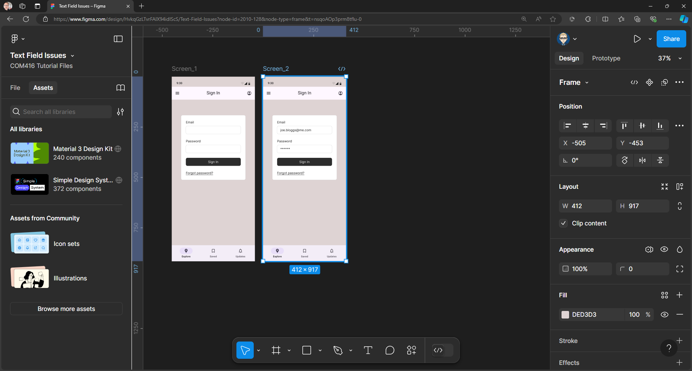

9.  Zoom in on the text field on **Screen\_2** - select the email section.

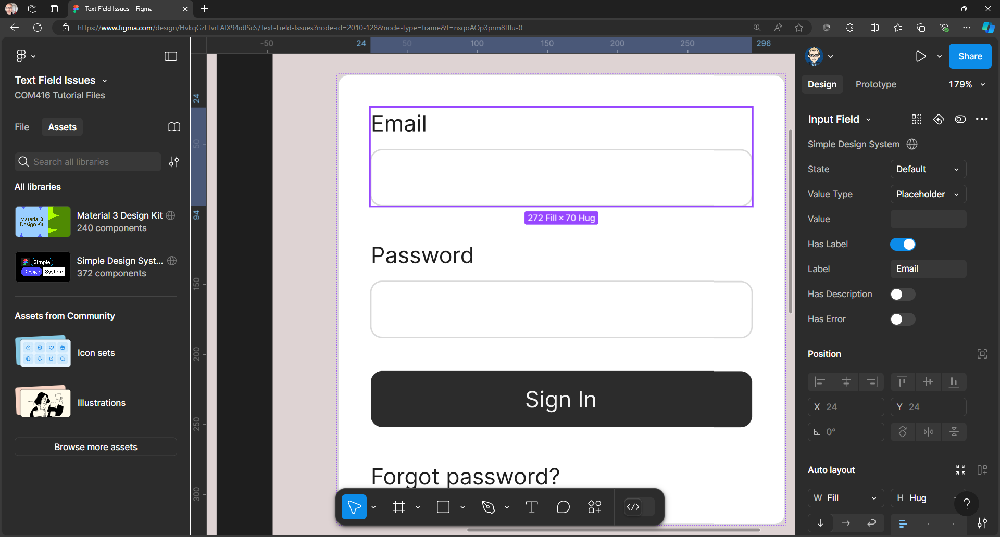

10. Change **Placeholder** to **Default** to make input text black.

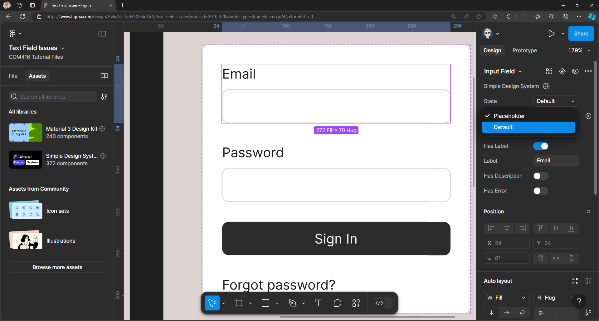

11. In the value field in the right panel add a fake email.

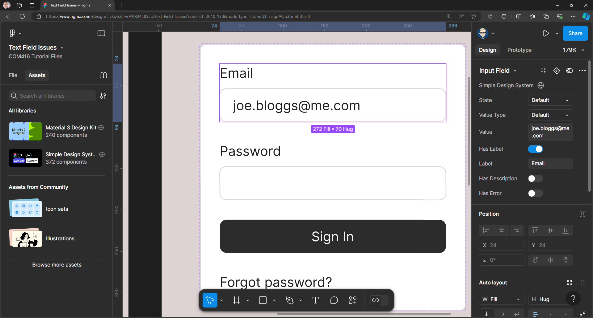

12. Repeat for Password: **Value Type** → **Default**, Value → `******`.

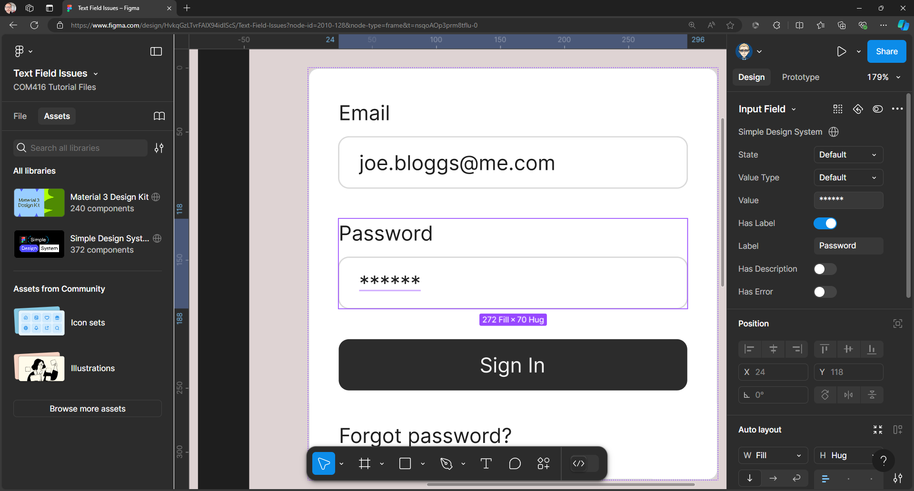

13. Zoom out to view screens:

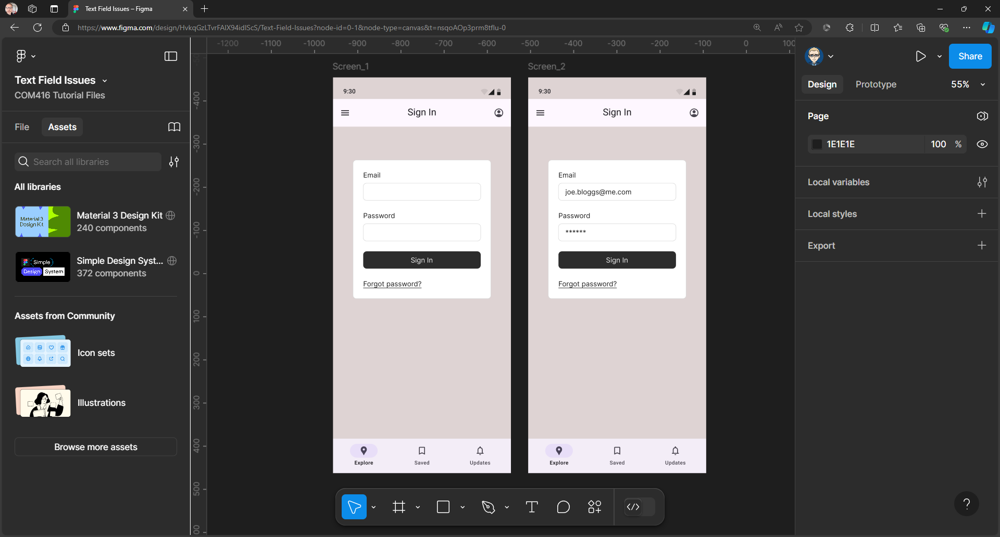

14. Move screens left to make space for **Screen\_3**.

15. Duplicate **Screen\_2** again, rename **Screen\_3**, delete **Log-in** component.

16. Layout will look like this:

17. In Assets in the right Panel search for **Review Card** with is part of the **Simple Design system**

18. Drag and drop to **Screen_3**

19. In your layers on in the left panel make sure the numbering runs top to bottom if not drag to re-arrange - make sure Frame folders are closed before you do this:

20. Switch to Prototype mode in the right properties panel

21. On **Screen_1** click and select the log-in component - a circle connection dot will appear drag this to **Screen_2** to link to it

On **Screen_2** click and select the Sign In button - a circle connection dot will appear drag this to **Screen_3** to link to it

00. Final layout:

