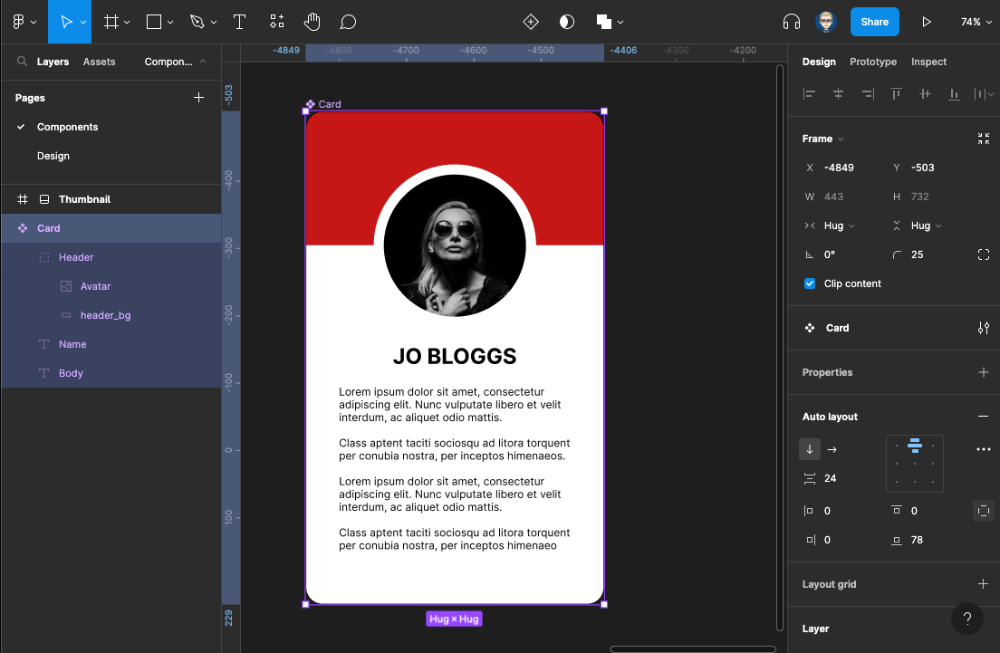

{: .no_toc }

# Simple Card Component

### Figma - Create a simple UI Card - Part 1 

Creating a simple UI Card component - we will look at creating frames, adding and formatting text, grouping layers, using plug-ins from Figma community, adding colour and images - using auto layout to design the card and then finally creating component and editing instances made from this component

<iframe src="https://solent.cloud.panopto.eu/Panopto/Pages/Embed.aspx?id=04cff5b4-98bb-432f-87f3-af4f014d7c97&autoplay=false&offerviewer=true&showtitle=true&showbrand=false&captions=true&interactivity=all" height="405" width="720" style="border: 1px solid #464646;" allowfullscreen allow="autoplay"></iframe>

### Figma - Create a simple UI Card - Part 2

<iframe src="https://solent.cloud.panopto.eu/Panopto/Pages/Embed.aspx?id=e9e47c3b-553c-41cc-9623-af4f014f5ef3&autoplay=false&offerviewer=true&showtitle=true&showbrand=false&captions=true&interactivity=all" height="405" width="720" style="border: 1px solid #464646;" allowfullscreen allow="autoplay"></iframe>

### Figma - Create a simple UI Card - Part 3

<iframe src="https://solent.cloud.panopto.eu/Panopto/Pages/Embed.aspx?id=804c9e67-43cd-4d8b-84ea-af4f01506981&autoplay=false&offerviewer=true&showtitle=true&showbrand=false&captions=true&interactivity=all" height="405" width="720" style="border: 1px solid #464646;" allowfullscreen allow="autoplay"></iframe>

### Figma - Create a simple UI Card - Part 4

<iframe src="https://solent.cloud.panopto.eu/Panopto/Pages/Embed.aspx?id=5f357a71-b01e-4506-b4c3-af4f0154d7e8&autoplay=false&offerviewer=true&showtitle=true&showbrand=false&captions=true&interactivity=all" height="405" width="720" style="border: 1px solid #464646;" allowfullscreen allow="autoplay"></iframe>

### Figma - Create a simple UI Card - Part 5

<iframe src="https://solent.cloud.panopto.eu/Panopto/Pages/Embed.aspx?id=99525551-bb9e-4ad0-8713-af4f015a4351&autoplay=false&offerviewer=true&showtitle=true&showbrand=false&captions=true&interactivity=all" height="405" width="720" style="border: 1px solid #464646;" allowfullscreen allow="autoplay"></iframe>

### Figma - Create a simple UI Card - Part 6 

<iframe src="https://solent.cloud.panopto.eu/Panopto/Pages/Embed.aspx?id=a818b053-2495-47bf-936b-af4f01573e9f&autoplay=false&offerviewer=true&showtitle=true&showbrand=false&captions=true&interactivity=all" height="405" width="720" style="border: 1px solid #464646;" allowfullscreen allow="autoplay"></iframe>

## Support for independent study

Guide from the Figma YouTube Channel with Playground file

<iframe width="560" height="315" src="https://www.youtube.com/embed/floQKLsWAy4" title="YouTube video player" frameborder="0" allow="accelerometer; autoplay; clipboard-write; encrypted-media; gyroscope; picture-in-picture" allowfullscreen></iframe>

[https://help.figma.com/hc/en-us/articles/360040451373-Create-dynamic-designs-with-auto-layout](https://help.figma.com/hc/en-us/articles/360040451373-Create-dynamic-designs-with-auto-layout)

