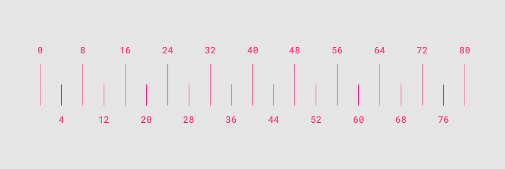
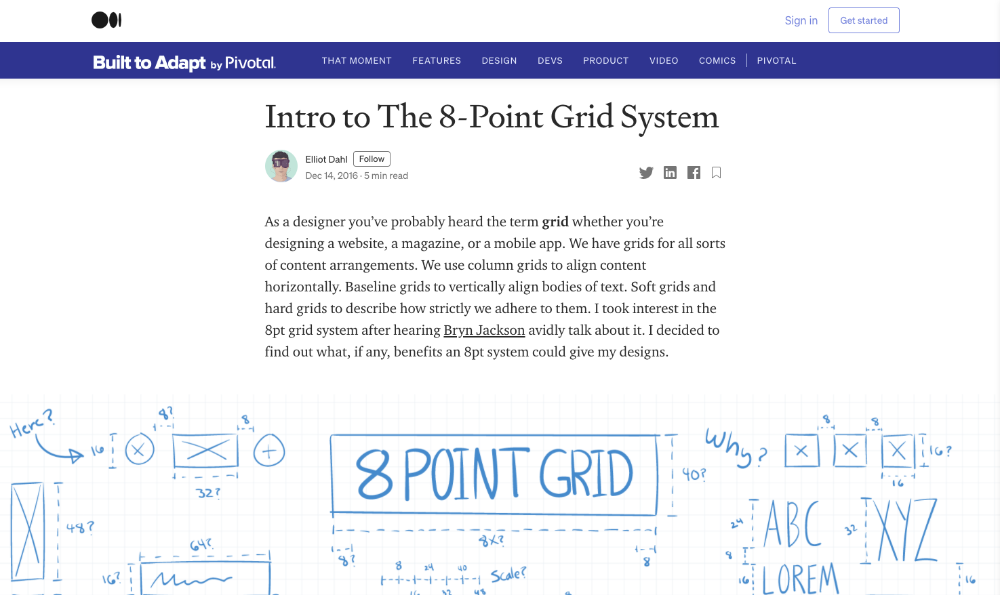
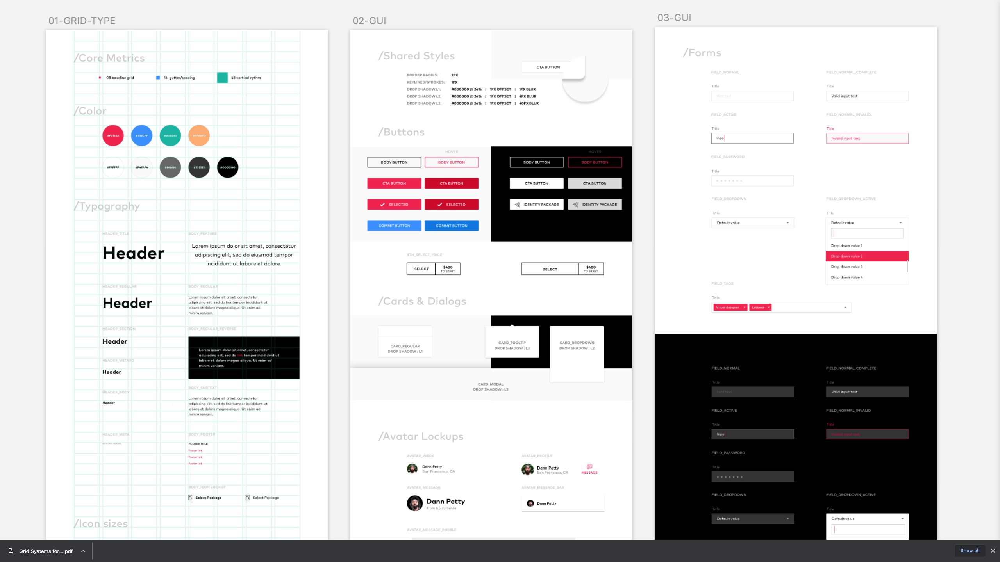
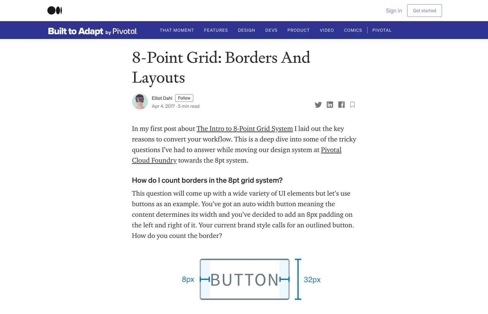

{: .no_toc }

# Designing with Grids

 
MATERIAL DESIGN, 2020. Material Design [viewed 4 November 2020]. Available from: [https://material.io/design/layout/understanding-layout.html#](https://material.io/design/layout/understanding-layout.html#) 

DAHL, E., 2016. Intro to The 8-Point Grid System - Built to Adapt [viewed 4 November 2020]. Available from: [https://builttoadapt.io/intro-to-the-8-point-grid-system-d2573cde8632](https://builttoadapt.io/intro-to-the-8-point-grid-system-d2573cde8632)  

BEUKELMAN, J., 2017. 8pt Material Design GUI Templates - Joel Beukelman - Medium [viewed 4 November 2020]. Available from: [https://medium.com/@_bklmn/8pt-gui-templates-ed8798badab3](https://medium.com/@_bklmn/8pt-gui-templates-ed8798badab3)

  
DAHL, E., 2017. 8-Point Grid: Borders And Layouts - Built to Adapt [viewed 4 November 2020]. Available from: [https://builttoadapt.io/8-point-grid-borders-and-layouts-e91eb97f5091](https://builttoadapt.io/8-point-grid-borders-and-layouts-e91eb97f5091)  