{: .no_toc }

# Variables - Strings

Create a circle 150x150 - colour it red

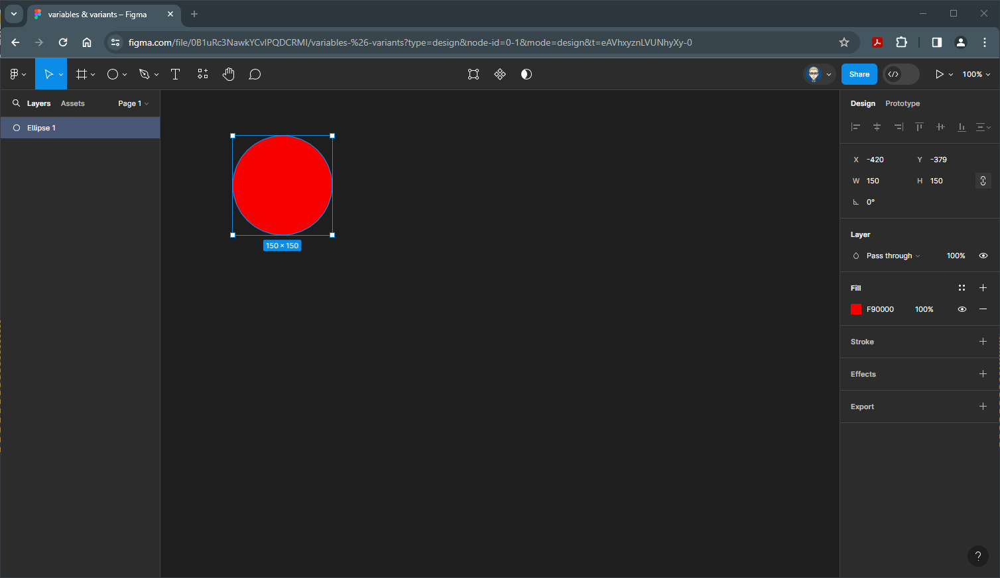

Make it into a componant either rightmove or click on the Create Componant on the top bar

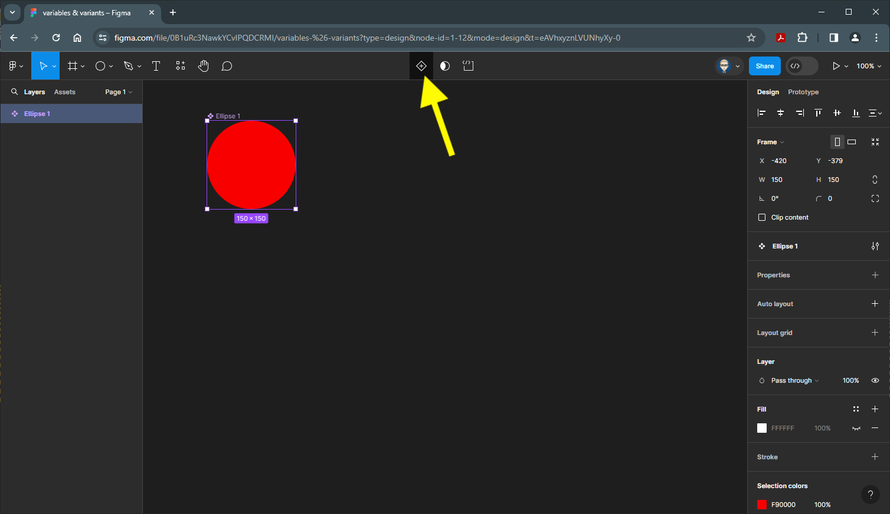

Now make it into a Variant Set by clicking on the icon on the on the top bar

Now there are two Variants, Create another Variant by clicking the purple `+` icon at the the bottom of the Variant Set

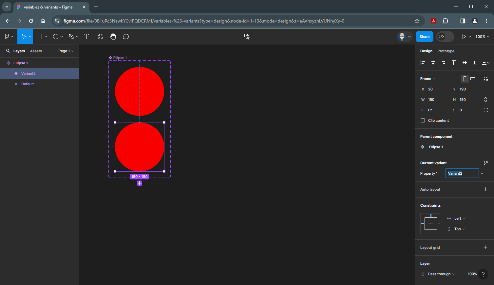

Create one more Variant

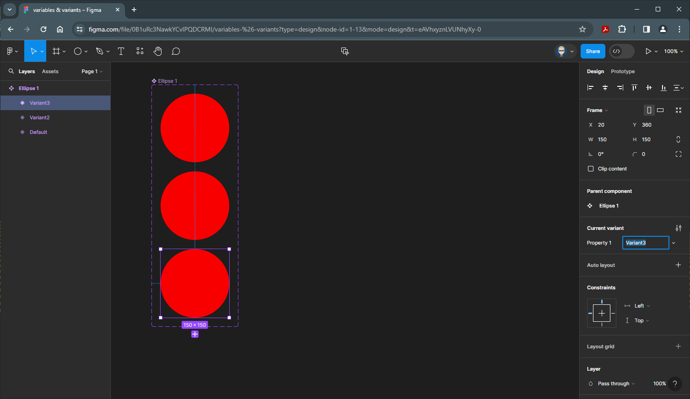

Colour this green

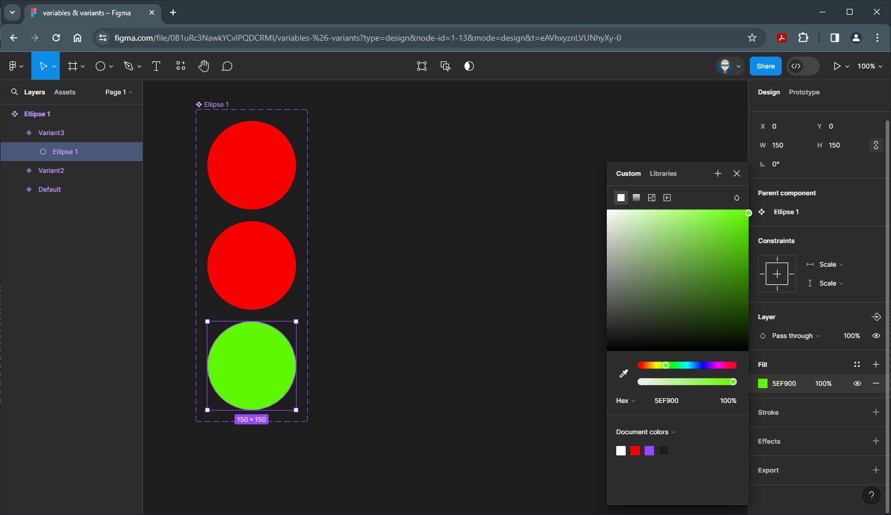

and colour the middle one blue

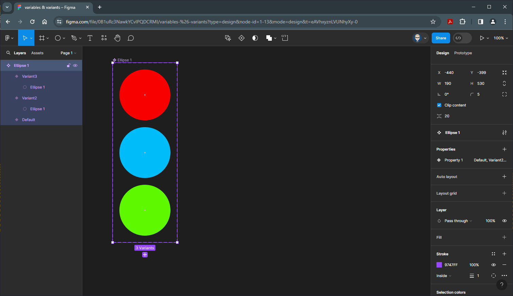

With the Variant Set selected 

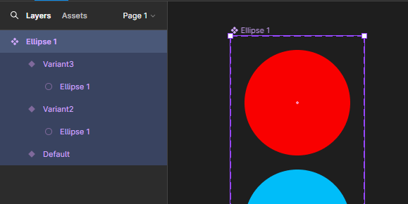

Rename it **circles** either in the Layers panel or the label on the Variant Set

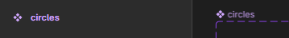

We need to rename each of the Variants to match their colours. Select the top Red circle and in the Properties Panel on the right, in the Current variant section type in **red** in lowercase

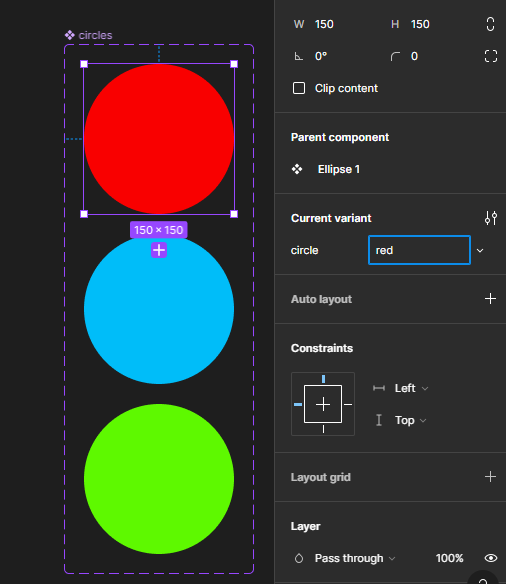

Repeat with the Blue circle and call it **blue** in lowercase

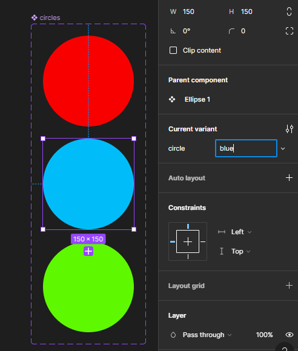

And finally repeat with the Green circle and call it **green** in lowercase

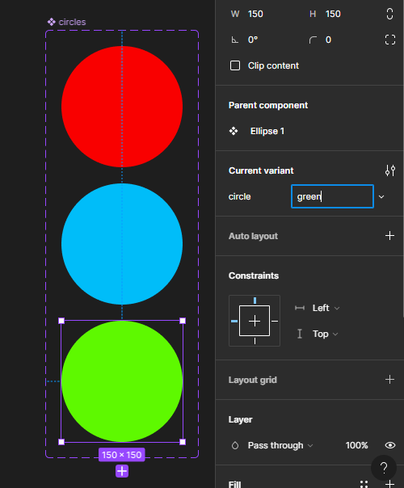

Your Layer Panel outline on the left will now look like this

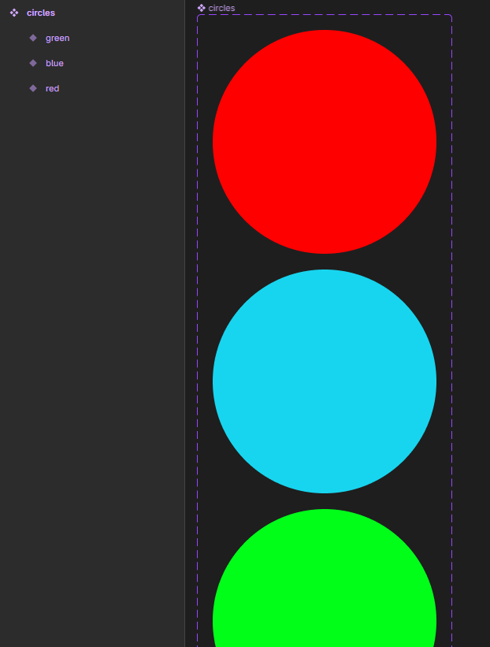

Now create a new Frame either by press`F` or select it from the top tools bar. In this example Android Large has been selected from the templates on the right

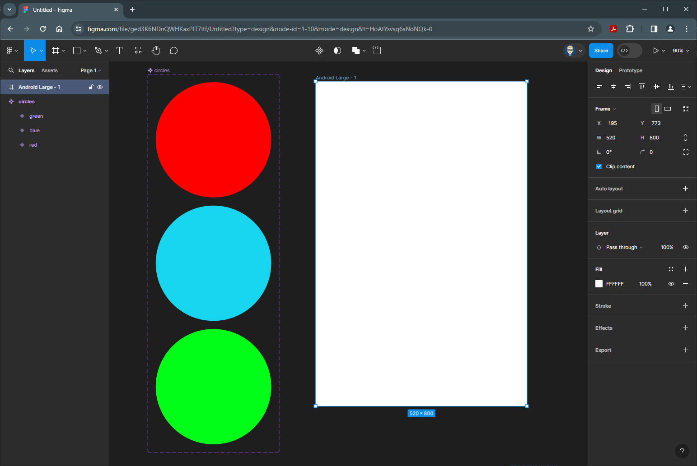

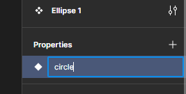

