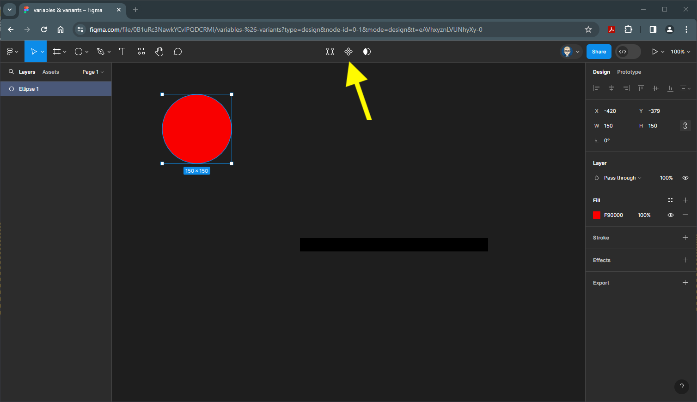

{: .no_toc }

# Variables - Strings

Create a circle 150x150 - colour it red

Make it into a component either right-mouse or click on the Create Component on the top bar

Now make it into a Variant Set by clicking on the icon on the on the top bar

Now there are two Variants, Create another Variant by clicking the purple `+` icon at the the bottom of the Variant Set

Create one more Variant

Colour this green

and colour the middle one blue

With the Variant Set selected 

Rename it **circles** either in the Layers panel or the label on the Variant Set

We need to rename each of the Variants to match their colours. Select the top Red circle and in the Properties Panel on the right, in the Current variant section type in **red** in lowercase

Repeat with the Blue circle and call it **blue** in lowercase

And finally repeat with the Green circle and call it **green** in lowercase

Your Layer Panel outline on the left will now look like this

Now create a new Frame either by press`F` or select it from the top Tools bar. In this example Android Large has been selected from the templates on the right

Create 3 100x100 Rectangles at the top of this new frame

Fill each of the rectangles with their corresponding colours from the circles in the Variant Set using the Eye Dropper

In the left panel switch to the **Assets** tab 

and drag a **Circles** instance underneath.

Make sure nothing is selected by clicking on the pasteboard or press `ESC` on your keyboard

From the **Properties** panel on the right in the **Local Variables** section

Select the Circle instance, then from the Properties panel on the right - in the instance properties section - click on the **Open Variables** icon

Click on the **Create variable** button and select **String** from the dropdown

The variable **Collection** panel will now open

Replave the String name a **Select Colour** and the Value a **red**

Select the Red rectangle.

v

