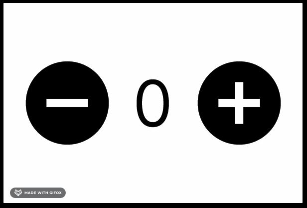
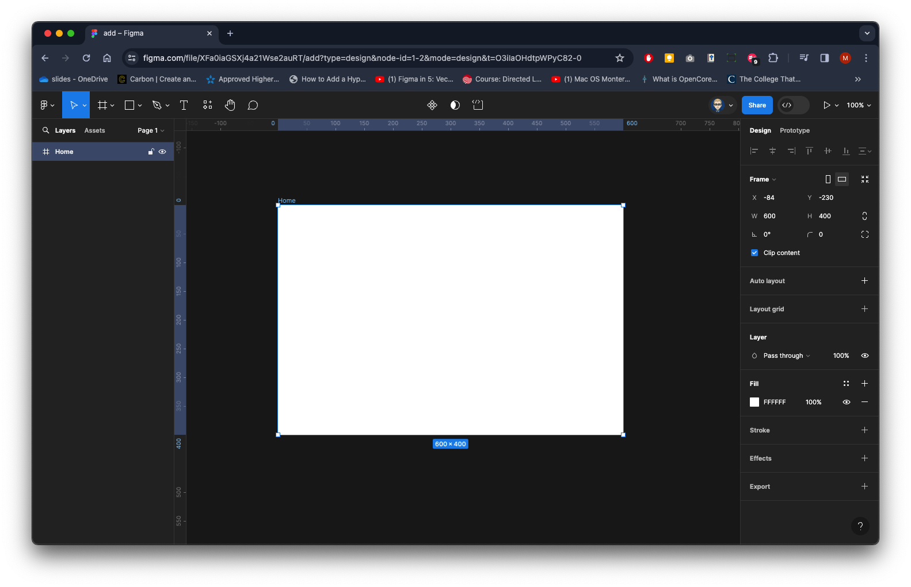
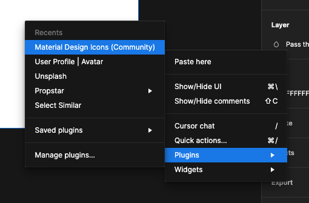
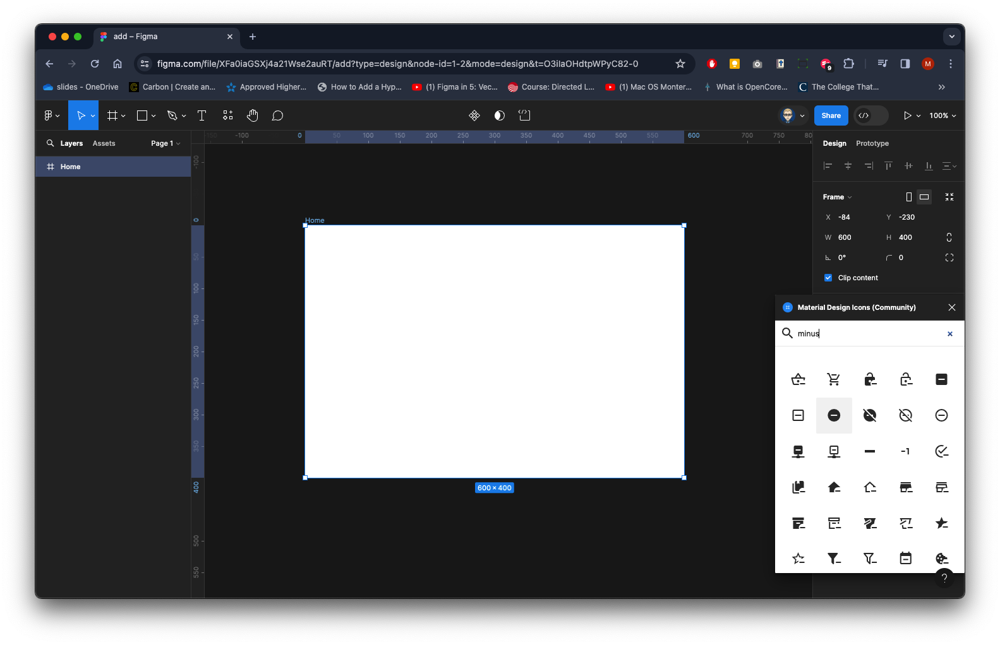
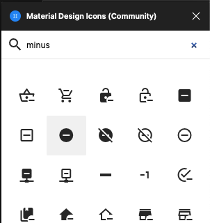
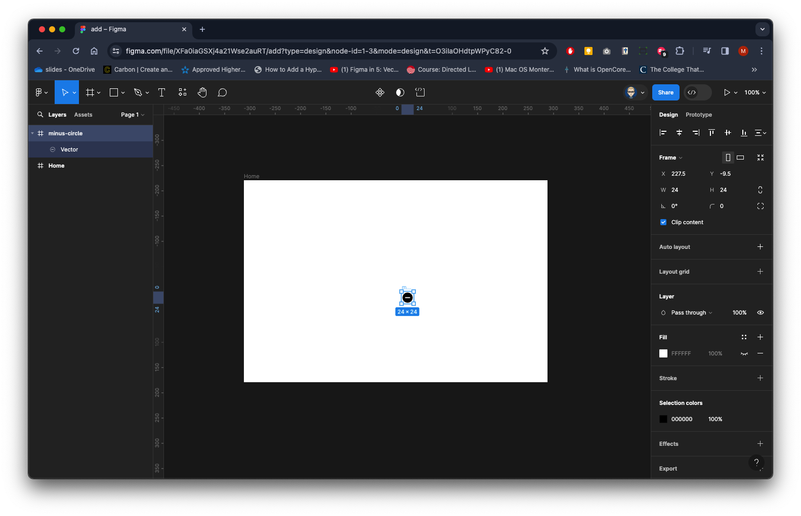
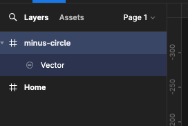
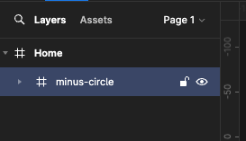
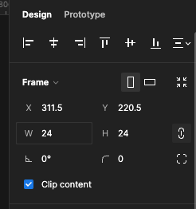

{: .no_toc }

# Variables - Number

Create a new Design Project, name it and create a Frame 600 x 400 and call it Home

Bring in a Minus ico using the Mterial Design Icons (Community) Plug in - Right Mouse to go to plugins (you might to to add from Figma Community uf you have not got access to this plugin)

Search for Minus

Click on it to add

Drag to the frame if needed

Make it is inside the frame in the Layers panel - in this case it is not 

So drag the minus-circle frame on the home frame

In the Properties the size is 24 x 24

Click on chain icon on the roght to lock H & W, then type in 200 for width and press `Enter` on keyboard

Icon will have scaled - reposition if needed

Repeat with searching, inserting and scaling to 200 x 200 a Plus icon - **plus-circle**

Again make it is inside the frame in the Layers panel - in this case it is not 

Drag it onto the Home frame

Position them with a gap as below

Create a Text box in the centre type in 0 with a size 128 and centre content vertical & horizontal

Make sure you have nothing selected - From the Properties panel on right in the Local Variables section click on add Variable icon

Click Create variable

and Number from dropdown

You can rename to aff meaning - but we will leave it as Number - close this panel

Select the text box with the 0. From the Properties panl on the right in the Text section click on the apply variable icon

You will now see Number click it to apply it to the text box

You will now see it applied in the Text box section of the properties

In the Properties panel on right switch Design to Prototype - Select the Plus icon on the left

In the Interaction section click on the `+` with On click change None to Set variable

You will now see Number in Local variables

Click on it to add

You will be in the **to** field - click on Number below to add again and select **Addition**

This will add a `+` after the variable's name

Type 1 and press `Enter` on your keyboard

This will apply to the interaction

Now select the minus icon on the left

Add Interaction - On click and none to Set variable

Click on the Number variable

You will be in the to field

Click on Number again to add it and select Subtraction from the dropdown

it will a a `-` after the variable's name

Type in 1 and press `Enter` on your keyboard

You should now have this:

Preview your Prototype - adding works well but minus gos dow to negative values - we need it to stop a 0

Select the minus icon on the left

You should still be in the Prototype in the Properties panel - click on the current interaction. You will the see the On click panel open

Click on the `+` to add a Conditional

You should noe see this - we need to set a Condition and am action

<iframe src="https://solent.cloud.panopto.eu/Panopto/Pages/Embed.aspx?id=bda8bffb-6681-4861-a3a1-b13100990833&autoplay=false&offerviewer=true&showtitle=true&showbrand=true&captions=true&interactivity=all" height="405" width="720" style="border: 1px solid #464646;" allowfullscreen allow="autoplay" aria-label="Panopto Embedded Video Player"></iframe>

