{: .no_toc }

# Variables - Number

Create a new Design Project, name it and create a Frame 600 x 400 and call it Home

Bring in a Minus ico using the Mterial Design Icons (Community) Plug in - Right Mouse to go to plugins (you might to to add from Figma Community uf you have not got access to this plugin)

Search for Minus

Click on it to add

Drag to the frame if needed

Make it is inside the frame in the Layers panel - in this case it is not 

So drag the minus-circle frame on the home frame

In the Properties the size is 24 x 24

Click on chain icon on the roght to lock H & W, then type in 200 for width and press `Enter` on keyboard

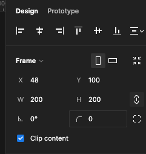

Icon will have scaled - reposition if needed

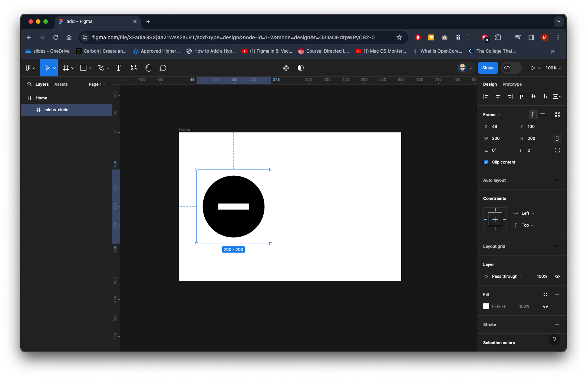

Repeat with searching, inserting and scaling to 200 x 200 a Plus icon - **plus-circle**

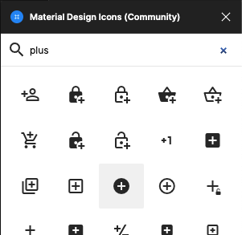

Again make it is inside the frame in the Layers panel - in this case it is not 

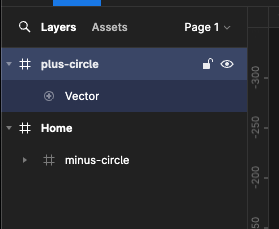

Drag it onto the Home frame

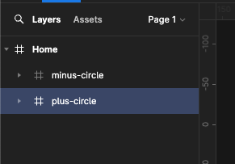

Position them with a gap as below

Create a Text box in the centre type in 0 with a size 128 and centre content vertical & horizontal

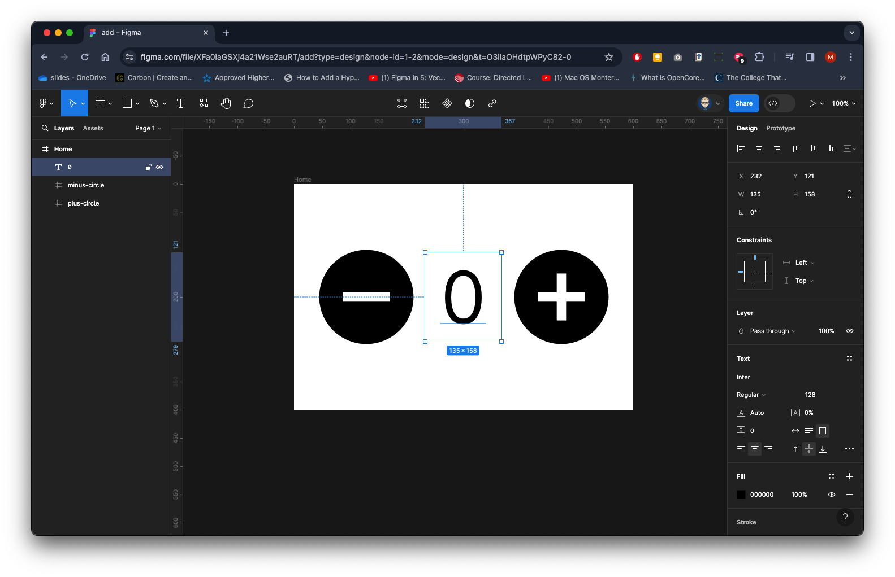

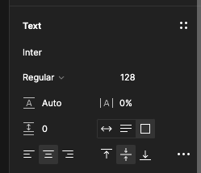

Make sure you have nothing selected - From the Properties panel on right in the Local Variables section click on add Variable icon

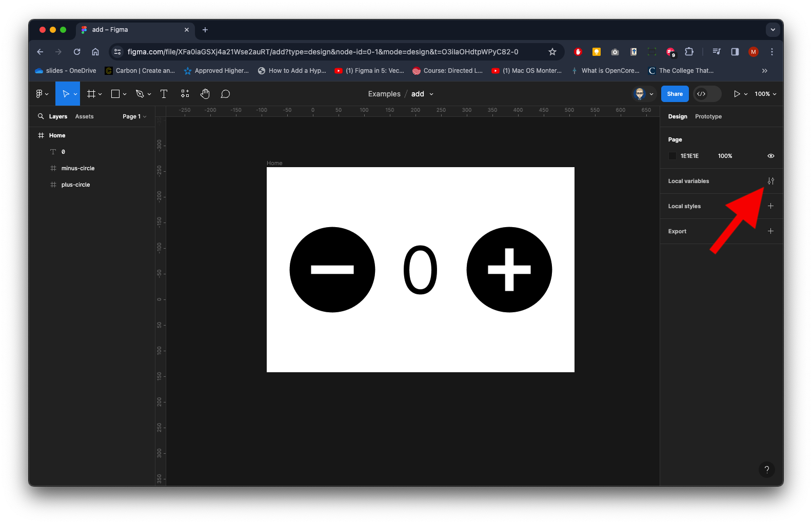

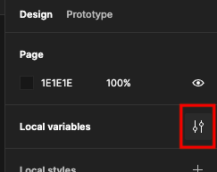

Click Create variable

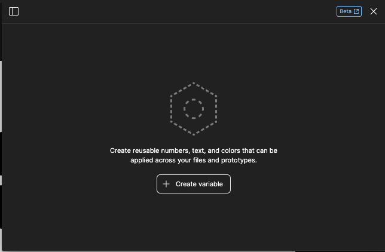

and Number from dropdown

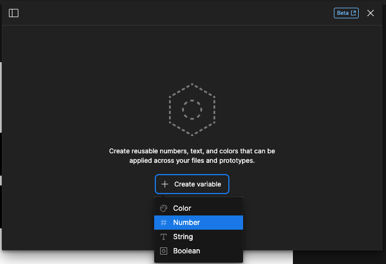

You can rename to aff meaning - but we will leave it as Number - close this panel

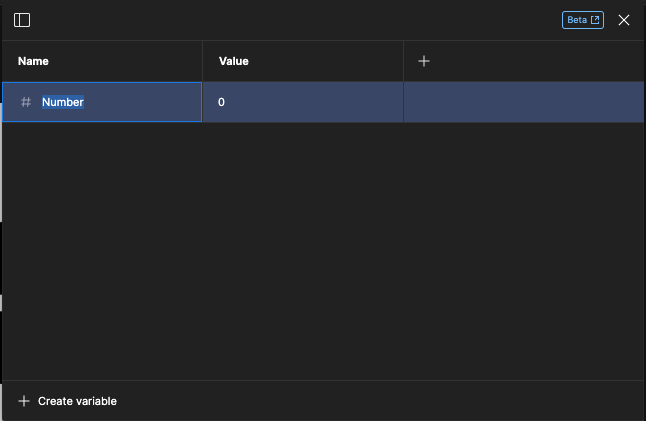

Select the text box with the 0. From the Properties panl on the right in the Text section click on the apply variable icon

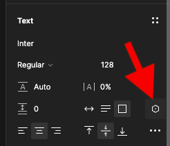

You will now see Number click it to apply it to the text box

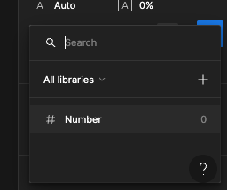

You will now see it applied in the Text box section of the properties

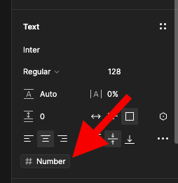

In the Properties panel on right switch Design to Prototype - Select the Plus icon on the left

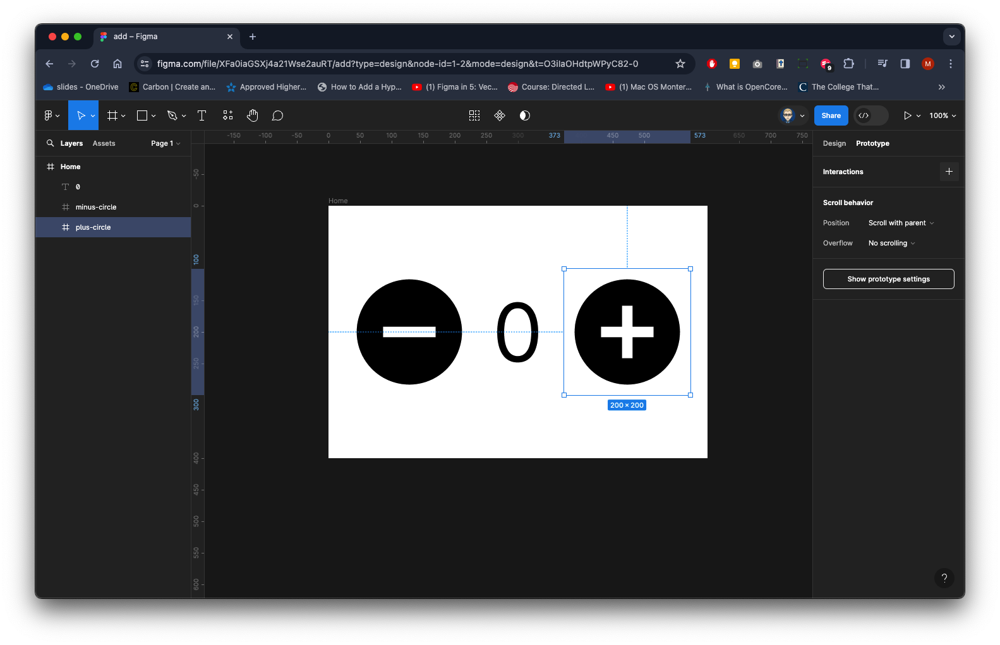

In the Interaction section click on the `+` with On click change None to Set variable

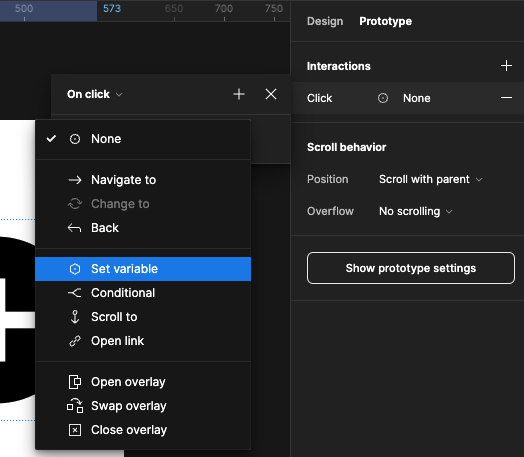

You will now see Number in Local variables

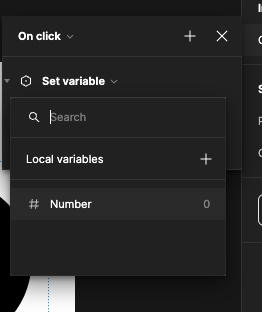

Click on it to add

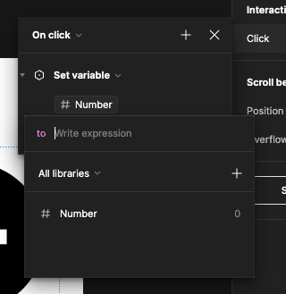

You will be in the **to** field - click on Number below to add again and select **Addition**

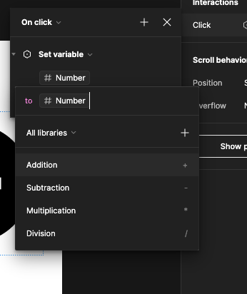

This will add a `+` after the variable's name

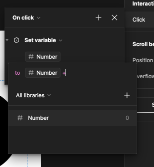

Type 1 and press `Enter` on your keyboard

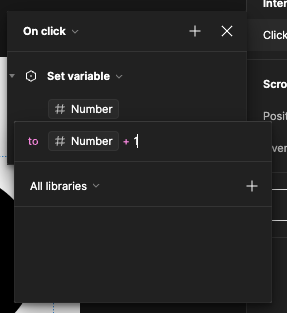

This will apply to the interaction

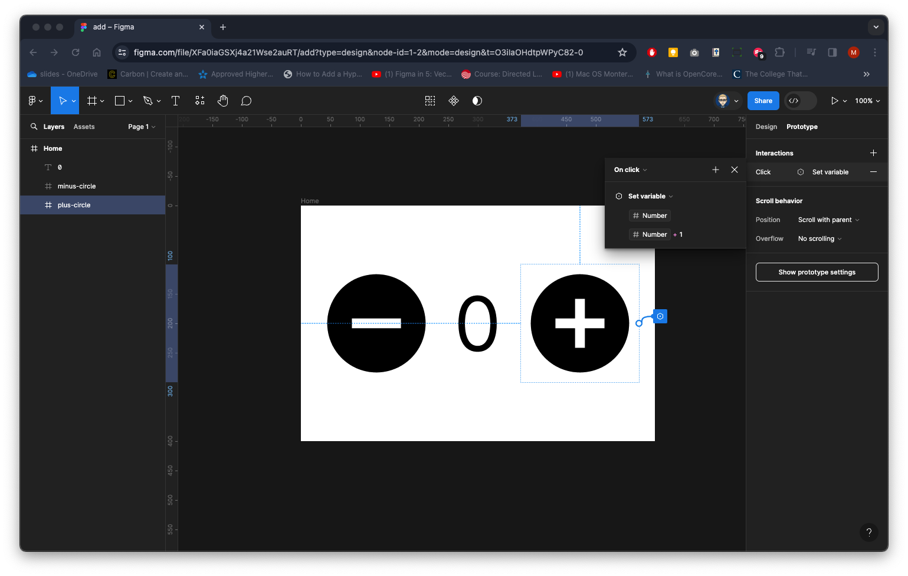

Now select the minus icon on the left

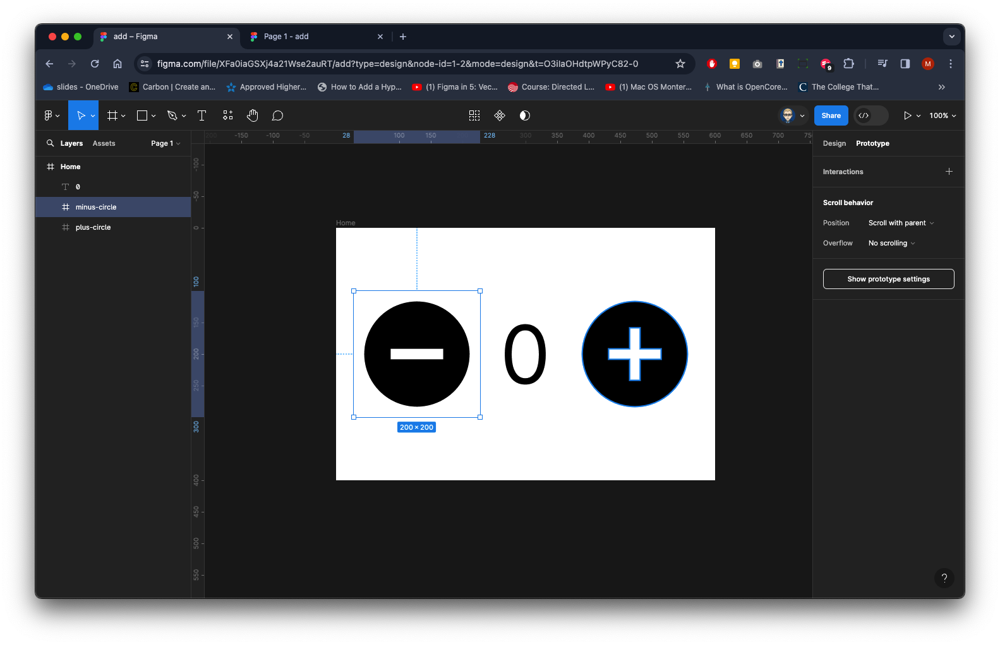

Add Interaction - On click and none to Set variable

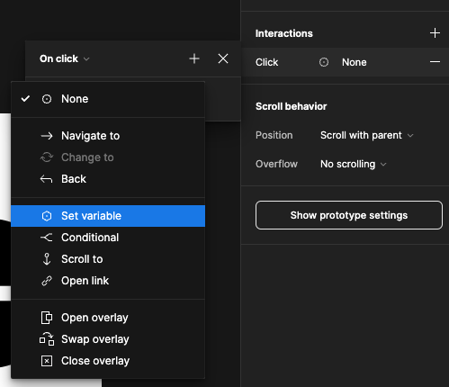

Click on the Number variable

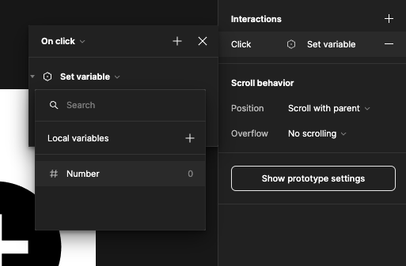

You will be in the to field

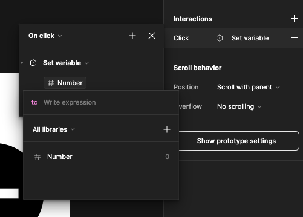

Click on Number again to add it and select Subtraction from the dropdown

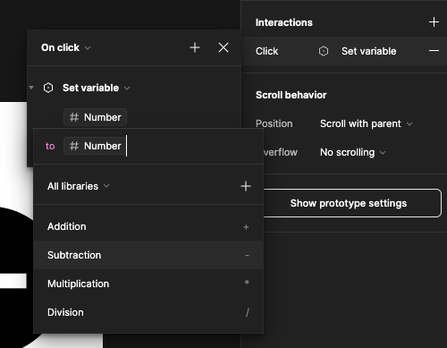

it will a a `-` after the variable's name

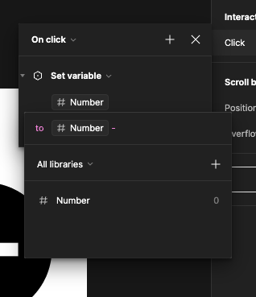

Type in 1 and press `Enter` on your keyboard

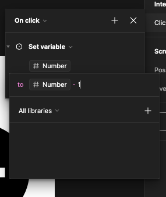

You should now have this:

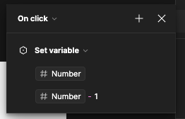

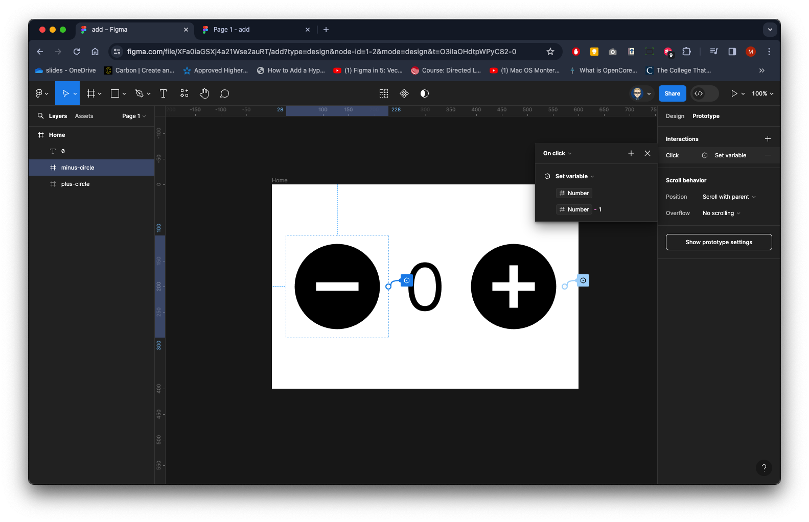

Preview your Prototype - adding works well but minus gos dow to negative values - we need it to stop a 0

Select the minus icon on the left

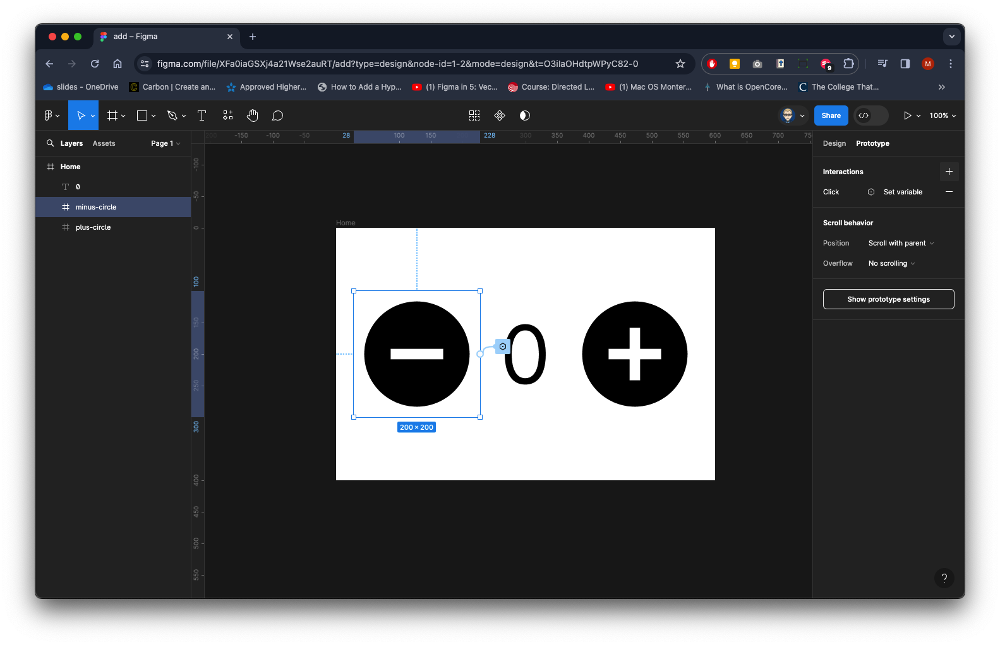

You should still be in the Prototype in the Properties panel - click on the current interaction. You will the see the On click panel open

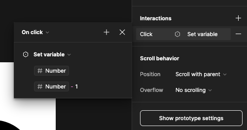

Click on the `+` to add a Conditional

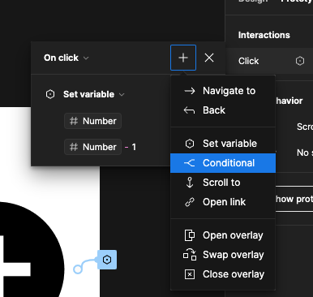

You should now see this - we need to set a Condition and an action which will stop the value going lower than **0**

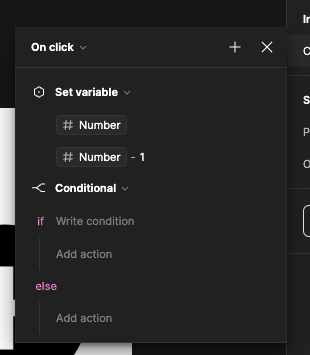

Once you have selected Conditional, click in the Write Condition then select the Number Variable

Then select Greater than

‘>’  will appear after the Number Variable, type in 0 and press ‘Enter’ on your keyboard

We now need to add an Else action – which will be the same are what we already have set – so we can just copy the Variable Set from the top.

First close the Set by click on the arrow on its left.

Then drag it under the If action.

Now close the panel – and run prototype – it should now go no lower than 0.

<iframe src="https://solent.cloud.panopto.eu/Panopto/Pages/Embed.aspx?id=bda8bffb-6681-4861-a3a1-b13100990833&autoplay=false&offerviewer=true&showtitle=true&showbrand=true&captions=true&interactivity=all" height="405" width="720" style="border: 1px solid #464646;" allowfullscreen allow="autoplay" aria-label="Panopto Embedded Video Player"></iframe>

