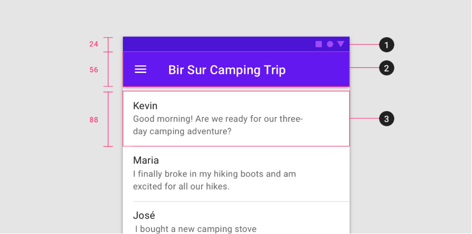

{: .no_toc }

# Adobe XD - Getting Started

When creating icons create an ArtBoard with a 1-pixel grid then create a 24 x 24 px container with no stoke and create your icon inside this with 2 to 3-pixel margins 

The group the container and the icon and name the group appropriately - you can also and then convert to a component.

Continue to create your icons

Get sizes from Google Material design sticker sheets and guidelines

Then create assets using the icons such as title bars, menus and navigation

[https://material.io/components/app-bars-top/\#](https://material.io/components/app-bars-top/)

**Useful resources and guidance:**

[https://adobexdplatform.com/plugin-docs/reference/ui/styles/typography.html\#headings](https://adobexdplatform.com/plugin-docs/reference/ui/styles/typography.html#headings)

[https://material.io/archive/guidelines/resources/sticker-sheets-icons.html\#](https://material.io/archive/guidelines/resources/sticker-sheets-icons.html)

[https://material.io/design/layout/spacing-methods.html\#](https://material.io/design/layout/spacing-methods.html)
[https://adobexdplatform.com/](https://adobexdplatform.com/)

## Basic layout for Fashion Shopping Cart

[Original eCommerce Concept design by Alfonso Severo](https://dribbble.com/shots/2051093-eCommerce-Concept-12-App-Screen)

[Download Design Assests](pictsXD_starter/home_screen_task_2.zip)

Create canvas 360 x 1000px with an 8 px grid

Go to the Window menu and show grid

Drag the viewport to 640px

Below are the sizes for each of the design elements

Be organised name and group layers -- either Shift click layers of items on the canvas -- then right mouse to group - then name.

Select the Status Br -- make sure it on the top of all your layers -- click the Prototype tab then check Fixed Position when scrolling

Load the Adobe XD app on your phone sign in and test it out