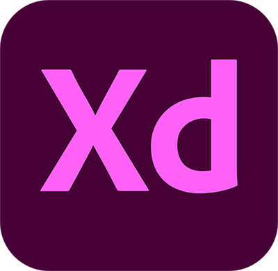
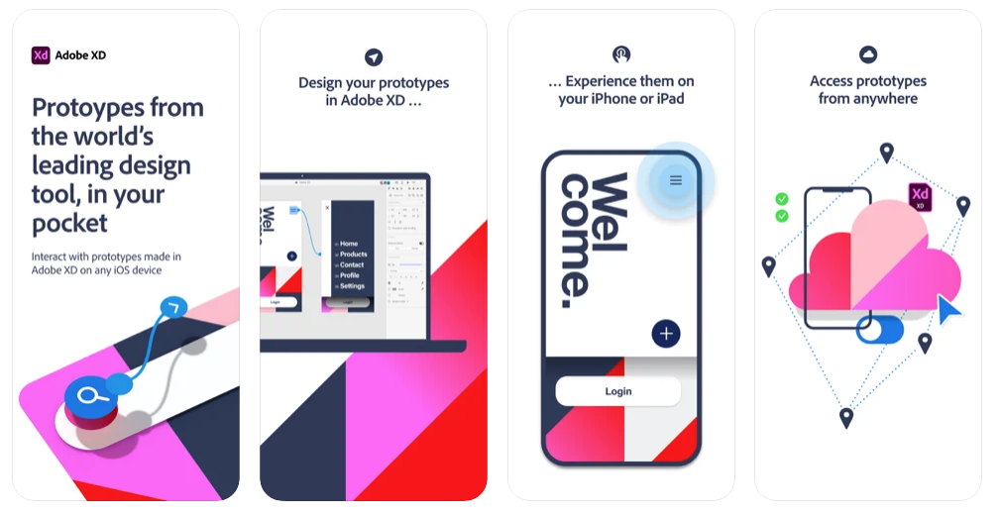

# Introduction to Figma

*Design - Prototype - Share: All in one app.*

"Adobe XD gives you everything you need to design and prototype websites, mobile apps, voice interactions, touch screens and more. It’s the fastest way to go from idea to experience all in the same app. And it’s free."

<iframe width="560" height="315" src="https://www.youtube.com/embed/-UMOPpZ8SBU" frameborder="0" allow="accelerometer; autoplay; clipboard-write; encrypted-media; gyroscope; picture-in-picture" allowfullscreen></iframe>

[Find out more about Adobe Xd](https://www.adobe.com/uk/products/xd.html){: .btn .btn-blue}

### Download the Adobe XD companion app for Apple and Android and test out your designs on a real device.

